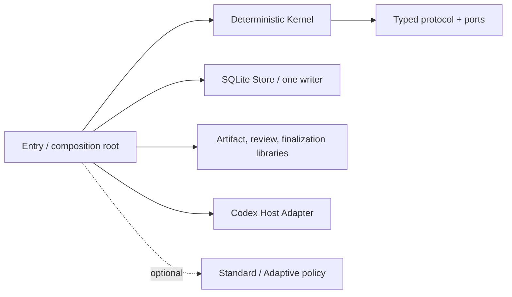

# LoopSkill 4.0

[](https://github.com/amanayayatu-tech/loop-skill/actions/workflows/v4-release.yml)
[](https://github.com/amanayayatu-tech/loop-skill/releases)
[](LICENSE)

[中文](README.md) · [中文快速开始](docs/v4/quickstart.zh-CN.md) · [English quickstart](docs/v4/quickstart.en.md)

<!-- parity: identity -->
> Release status: the 4.0.0 candidate is passing release gates. It is not described as a published stable release until the tag and GitHub Release exist.

LoopSkill turns long-running work into a recoverable loop with explicit authority, evidence, and stop conditions. An ordinary user supplies only a goal or goal file; machines own protocol identities, versions, receipts, and Host readback. The necessary human boundary remains:

`INTAKE → PREPARE → CONFIRM → START`

<!-- parity: break -->
## Breaking-release notice

LoopSkill 4 is a **v4-only hard break**. It preserves validated v3 safety principles, but it does not open, import, repair, or run v3 loops, Controller Packs, MCP state, or CLI data. There is no automatic migration and no dual write.

To keep using old data, independently install or retain [LoopSkill v3.3.8](https://github.com/amanayayatu-tech/loop-skill/releases/tag/v3.3.8). The v4 installer does not modify it.

<!-- parity: changes -->
## What changed in 4.0

- One typed protocol manifest defines command, event, reference, receipt, capability, and error wire shapes.
- The deterministic Kernel depends only on the typed protocol and ports; SQLite Store is the sole canonical writer.
- Artifact, review, finalization, and the Codex Host Adapter remain outside the Kernel boundary.
- Operation IDs, handles, Actor/Grant references, revisions, receipts, digests, and Host identities are machine-generated, parsed, or verified.
- Standard, Adaptive, Reviewer, Local Verifier, Decision Card, and repair are optional policy; the minimal path loads no policy pack.
- An external effect receives at most one automatic attempt; without authoritative readback it honestly becomes `UNKNOWN` or `UNVERIFIABLE`.

<!-- parity: install -->
## 30-second install

Requirements: macOS or Linux, Git, and Python 3.11–3.14. The LoopSkill 4 runtime uses only the Python standard library.

```bash
git clone --branch v4.0.0 --depth 1 https://github.com/amanayayatu-tech/loop-skill.git
cd loop-skill
bash scripts/install.sh
LOOPSKILL4="${CODEX_HOME:-$HOME/.codex}/skills/loopskill4/scripts/loopskill4"
"$LOOPSKILL4" --help
```

The distinct installation target is `$CODEX_HOME/skills/loopskill4`. LoopSkill 4 itself does not register MCP, edit `config.toml`, or require a Codex App restart for LoopSkill installation or use. Codex or another product may still require a restart for unrelated reasons.

<!-- parity: usage -->
## Simplest usage

Create `goal.json`:

```json
{
  "goal": "Complete and verify one small change in a disposable example directory",
  "task_horizon": "long",
  "write_scope": ["disposable-example"],
  "budget": "20 minutes; no network or publish",
  "external_actions": [],
  "acceptance_criteria": ["focused tests pass", "result is reviewed"],
  "stop_conditions": ["stop on unknown external state"],
  "authorization_boundaries": ["no commit, push, publish, deploy, or real-user data"]
}
```

Then use one main entry:

```bash
LOOPSKILL4="${CODEX_HOME:-$HOME/.codex}/skills/loopskill4/scripts/loopskill4"
"$LOOPSKILL4" start goal.json
```

The same interaction performs read-only intake, writes local preparation artifacts, and shows the Goal, write scope, budget, external actions, acceptance criteria, stop conditions, and publication boundary. Only exact explicit confirmation can start. A non-interactive session stops at PREPARE; `DIRECT_TASK_RECOMMENDED` creates no loop.

The four phases may also be invoked explicitly:

```bash
"$LOOPSKILL4" intake goal.json
"$LOOPSKILL4" prepare goal.json --output ./prepared-loop
"$LOOPSKILL4" confirm ./prepared-loop
"$LOOPSKILL4" start ./prepared-loop --root ./loopskill4-data
```

<!-- parity: no-control -->
## What ordinary users never provide manually

The number of user-supplied control identities must be zero. Users do not copy task/thread/turn/route/effect/artifact/review/finalization IDs or paste SHA values, receipts, Pack identity, Gateway schemas, MCP/App enums, heartbeat, readback, or retry parameters. Even if model text contains such a value, it receives no authority.

<!-- parity: status -->
## Status, result, and limitations

```bash
"$LOOPSKILL4" status --root ./loopskill4-data
"$LOOPSKILL4" status --root ./loopskill4-data --diagnostics
```

Default status shows only the goal, progress, result, limitations, and actionable next step. Internal identity and receipts appear only in explicit diagnostics. `UNKNOWN` means an external action may have happened but cannot be authoritatively confirmed; `UNVERIFIABLE` means the Host cannot provide the required assurance. Neither is success, and neither triggers blind resend.

<!-- parity: policy -->
## Optional policies

Standard provides a fixed dependency-ordered Goal Queue. Adaptive provides one active goal and bounded, versioned roadmap revision. Reviewer, Local Verifier, Decision Card, human steering, and bounded repair are optional capabilities. They may submit authorized semantic commands, but cannot write the Store, sign Host receipts, or become a Supervisor.

<!-- parity: architecture -->
## Architecture



Store does not control Host; Artifact and Host do not write canonical state. One state authority may maintain orthogonal aggregate/event streams—it does not imply one giant enum or one physical event stream. See the [architecture map](docs/v4/architecture-map.md), [ADR 0011](docs/adr/0011-loopskill-4-compatible-kernel-refactor.md), and [typed protocol](protocol/v4/README.md).

<!-- parity: safety -->
## Safety and recovery

- Local operation acceptance, per-loop CAS, outbox, and snapshot commit in one SQLite transaction.
- Replaying the same operation ID and request creates no second event, handle, or effect; a changed request returns an idempotency conflict.
- With provider idempotency keys and authoritative readback, the product says only effectively-once.
- Otherwise it promises only at-most-one automatic attempt; a crash or lost response may leave `UNKNOWN`.
- Path traversal, symlinks, case-fold aliases, special files, and open/read races fail closed.
- Artifact correctness, workflow closure, assurance, and external-effect finalization are separate facts and cannot substitute for one another.

<!-- parity: evidence -->
## Evidence boundary

Repository unit, fault-injection, conformance, isolated-install, and disposable Codex App canary evidence proves only contract behavior for its bound version and scenario. It does not prove patch-success superiority, arbitrary long-horizon efficacy, a fault-free Host, or cross-system exactly-once.

<!-- parity: v3 -->
## v3 hard boundary

When v4 encounters a v3 root, state, or Controller Pack, it performs zero writes and returns stable `USER_UNSUPPORTED_LEGACY_VERSION` with a link to the [v3.3.8 Release](https://github.com/amanayayatu-tech/loop-skill/releases/tag/v3.3.8). v4 ships no importer, repair path, legacy CLI alias, Pack runtime, or v3 MCP State Gateway.

<!-- parity: uninstall -->
## Uninstall and fallback

The installer prints the receipt path. Uninstall with that exact receipt:

```bash
python3 scripts/uninstall_v4.py --codex-home "${CODEX_HOME:-$HOME/.codex}" --receipt "${CODEX_HOME:-$HOME/.codex}/install-receipts/loopskill4/<receipt>.json"
```

Uninstall removes only the receipt-bound v4 installation and leaves `config.toml` and an independent v3 installation byte-identical. Fallback means uninstalling v4 and continuing to use separately installed v3.3.8; v4 does not restore, convert, or migrate v3 data.

<!-- parity: limitations -->
## Known limitations

- The first release supports only the Codex Host Adapter; a host-neutral Kernel is not a multi-host claim.
- There is no cross-system exactly-once promise across SQLite, Codex, Git, and network boundaries.
- There is no claim of empirically improved patch success or long-horizon superiority.
- Memory isolation is reported only to the strength the Host can actually attest, which may be unavailable or unverifiable.
- Git/non-Git/new-Git capture runs only inside an authorized root and verified capability.

See [known limitations](docs/v4/known-limitations.md) for the complete list.

<!-- parity: contributor -->
## Development and validation

```bash
python3 scripts/generate_v4_protocol.py --check
python3 scripts/validate_v4_preservation.py --root . --json
PYTHONDONTWRITEBYTECODE=1 python3 -B -W error -m unittest discover -s tests -p 'test_v4*.py' -v
coverage run -m unittest discover -s tests -p 'test_v4*.py'
coverage report
python3 scripts/check_v4_docs.py
```

CI also runs Linux/macOS isolated installation, dependency/import-graph, stale legacy runtime, privacy/secret/large-artifact, SBOM/license, and release-identity gates. The real Codex App canary is an exact-SHA local release gate; GitHub-hosted runners do not fake it.

<!-- parity: release -->
## Release, security, and historical versions

- [v4 release process](docs/RELEASING.md)
- [4.0 release notes](docs/v4/release-notes.md)
- [Security policy](SECURITY.md)
- [MIT License](LICENSE)
- [v3.3.8 historical release](https://github.com/amanayayatu-tech/loop-skill/releases/tag/v3.3.8)
- [All GitHub Releases](https://github.com/amanayayatu-tech/loop-skill/releases)
