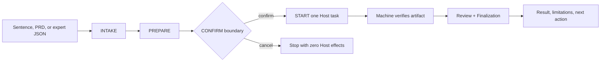
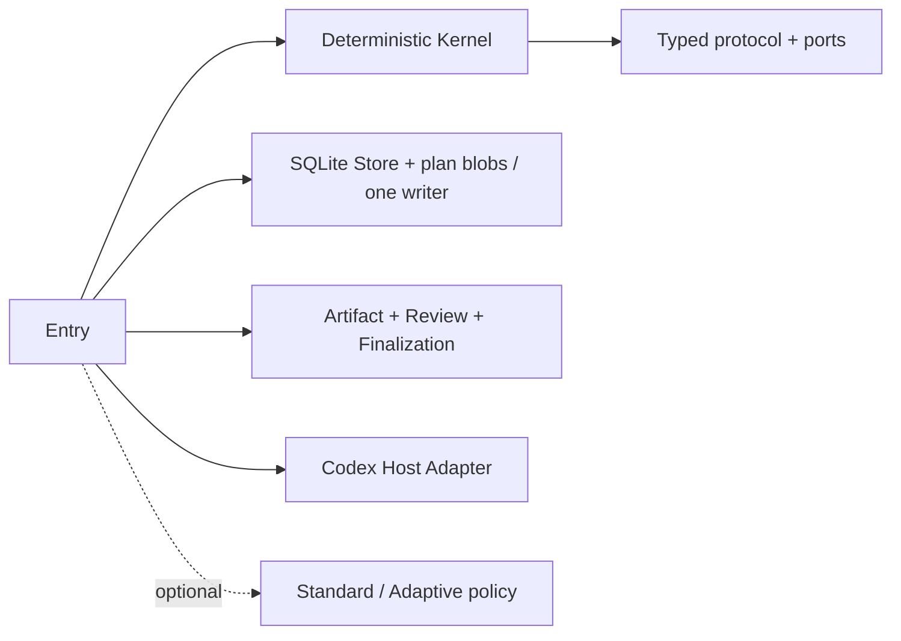
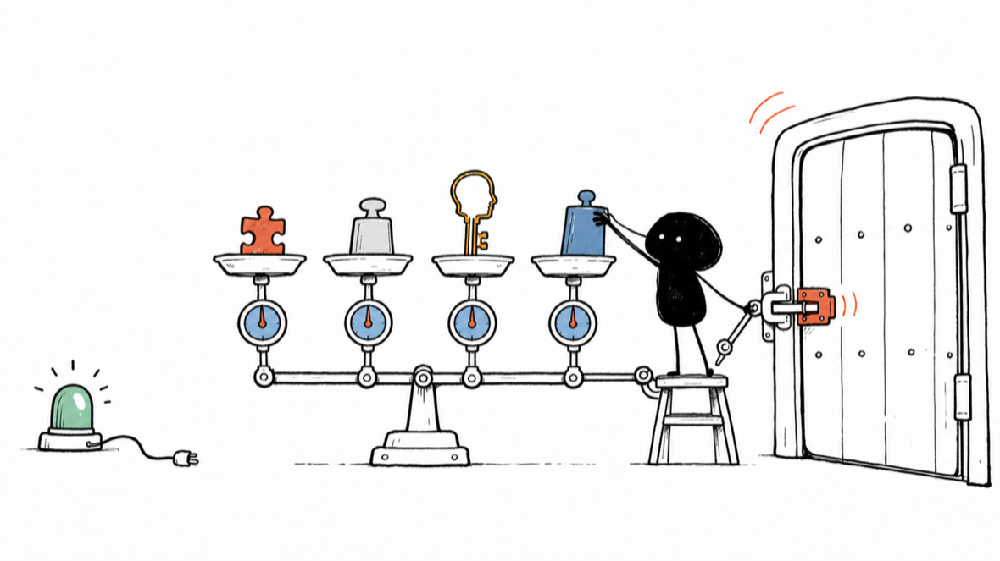

# LoopSkill 5 Skill / LoopSkill 4.2 runtime

[](https://github.com/amanayayatu-tech/loop-skill/actions/workflows/v4-release.yml)
[](https://github.com/amanayayatu-tech/loop-skill/actions/workflows/v5-release.yml)
[](https://github.com/amanayayatu-tech/loop-skill/releases)
[](LICENSE)

[中文](README.md) · [5.0 中文快速开始](docs/v5/quickstart.zh-CN.md) · [5.0 English quickstart](docs/v5/quickstart.en.md) · [5.0 release notes](docs/v5/release-notes-v5.0.0.md)

This repository carries two independent product identities. The current LoopSkill 5 product is a natural-language Codex Skill whose install contains exactly `loopskill5/SKILL.md` and `loopskill5/agents/openai.yaml`. The preserved LoopSkill 4.2 product is an independent Python runtime. The root `VERSION=4.2.0` and `scripts/install.sh` belong only to v4; neither is the v5 version nor its installer.

LoopSkill 5 investigates the real environment before one START, recommends how to extend the unattended span, and presents a 12-item human-readable Launch Contract. After START it relies on the current Codex task/thread and Host-native continuation to reach a real business result or a disclosed business Gate without asking the user for JSON, IDs, digests, or recovery commands.

The public v5.0.0 identity exists only when GitHub Releases contains the annotated `v5.0.0` tag, the two exact Skill blobs at that tag, and the matching GitHub Release. Only after [Releases](https://github.com/amanayayatu-tech/loop-skill/releases) lists it, use the system `$skill-installer` with `https://github.com/amanayayatu-tech/loop-skill/tree/v5.0.0/loopskill5`; the installer refuses to overwrite an existing destination. Uninstallation only moves the exact `loopskill5` directory recoverably out of `skills`; it does not run the v4 installer or read or migrate v3/v4 data. Complete steps are in the 5.0 Chinese and English quickstarts linked above.

LoopSkill 5 has no LoopSkill-owned Controller, state machine, database, daemon, queue, general retry system, or compatibility layer. If `codex-loop-prompt-architect/scripts/loopskill5` appears in development history, it is only a DEVELOPMENT harness, never the public entry, and it is absent from the v5 release branch.

LoopSkill 4 users should continue with the [v4 Chinese quickstart](docs/v4/quickstart.zh-CN.md) or [v4 English quickstart](docs/v4/quickstart.en.md). Installing, using, or uninstalling v5 must not overwrite `loopskill4` or legacy data.

<!-- parity: identity -->
> The retained sections below describe the LoopSkill 4.2 runtime. This document describes LoopSkill 4.2.0. See [Releases](https://github.com/amanayayatu-tech/loop-skill/releases) for the public versions currently available.

**Describe the job in one sentence. LoopSkill fixes the boundary first, starts once after confirmation, and uses machine evidence to show what worked and what remains uncertain.**

A chat can end before a long task is truly complete. Context can drift, scope can grow, a step can run twice, or “done” can arrive without proof that the file is correct. LoopSkill does not promise permanent autonomous execution. It organizes one foreground Codex Host task around a goal, boundary, acceptance criteria, and stop conditions.


Start with one sentence, pasted PRD text, or one explicitly authorized UTF-8 `.txt` / `.md` file; ordinary users do not create JSON. LoopSkill asks only 1–3 questions that truly block start, retains confirmed answers for the current session, then walks through:

`INTAKE → PREPARE → CONFIRM → START`

There is no Host execution before confirmation. After confirmation, only one Goal is active at a time. You see the goal, progress, result, limitations, and next action—not a wall of thread IDs, SHA values, or receipts.

<!-- parity: break -->
## Problems it solves

- **Scope keeps growing**: write scope, budget, external actions, acceptance, and stop conditions are fixed before start.
- **Lost output causes blind redo**: once an Attempt is claimed it is not automatically sent again; missing evidence becomes `UNKNOWN`.
- **Old evidence looks like a new result**: Result, Artifact, Review, and Finalization bind the current chain.
- **The model transports control data**: neither users nor models copy IDs, SHA values, receipts, schemas, or App enums.
- **“Done” has no definition**: local artifacts are checked against explicit criteria, separately from workflow closure and external-effect evidence.

LoopSkill 4 is a **v4-only hard break**. It keeps v3 safety principles but does not open, import, repair, or run v3 loops, Controller Packs, MCP state, or legacy CLI data.

<!-- parity: changes -->
## When to use it

| Use LoopSkill | Use Codex directly |
| --- | --- |
| Multi-step work likely to be interrupted | One question or a tiny one-file edit |
| Write or external-action boundaries need confirmation | No persistent state or recovery is needed |
| Artifact, review, and closure must be checked | You can immediately inspect the result yourself |
| Uncertain external outcomes must not be retried blindly | Repeating the operation has no side effect |

Intake returns `READY_FOR_LOOP`, `NEEDS_CLARIFICATION`, `BLOCKED`, or `DIRECT_TASK_RECOMMENDED`. A short task is not forced into a loop.

<!-- parity: install -->
## Start in 3 minutes

Prerequisites: macOS or Linux, Git, Python 3.11–3.14, and an authenticated official Codex installation. The LoopSkill 4 runtime uses only the Python standard library.

The command below installs the published `v4.2.0` tag:

```bash
git clone --branch v4.2.0 --depth 1 https://github.com/amanayayatu-tech/loop-skill.git
cd loop-skill
bash scripts/install.sh
LOOPSKILL4="${CODEX_HOME:-$HOME/.codex}/skills/loopskill4/scripts/loopskill4"
"$LOOPSKILL4" --help
```

The install is separate from v3. LoopSkill 4 itself **does not register MCP**, edit Codex `config.toml`, **or require a Codex App restart** for installation or use.

Invoke `$loopskill4` in a Codex conversation and state the goal directly, for example:

```text
Create and verify release-checklist.md in this workspace; do not use the network, delete existing content, commit, push, publish, or deploy, and use at most four Host invocations.
```

The Skill fills scope, acceptance, and stop blockers in the current session, then converges on the same machine entry. Experts may instead provide semantic JSON or a canonical PlanDocument:

```bash
LOOPSKILL4="${CODEX_HOME:-$HOME/.codex}/skills/loopskill4/scripts/loopskill4"
"$LOOPSKILL4" start ./requirements.md
```

It does not start silently. You first see the intake result and prepared boundary, then explicitly confirm. A non-interactive session stops at PREPARE; `DIRECT_TASK_RECOMMENDED` creates no loop.

<!-- parity: usage -->
## From goal to result



You can also invoke the four phases explicitly:

```bash
"$LOOPSKILL4" intake ./requirements.md
"$LOOPSKILL4" prepare ./requirements.md --output ./prepared-loop
"$LOOPSKILL4" confirm ./prepared-loop
"$LOOPSKILL4" start ./prepared-loop --root ./loopskill4-data
```

INTAKE is strictly read-only. PREPARE writes only an owner-only local manifest, boundary summary, human plan, canonical PlanDocument, PlanIndex, and capacity report; it does not create the runtime Store. CONFIRM binds every prepared artifact, so any change invalidates the old confirmation. Only a valid START writes content-addressed plan blobs, creates the compact Loop, and claims one machine-managed Attempt for the current Goal.

### A concrete example

Suppose you ask Codex to create `release-checklist.md`:

1. You describe the goal, allowed file, and acceptance criteria.
2. LoopSkill decides whether the work merits a loop and identifies missing information.
3. You confirm “write only this file; no publish; no network.”
4. Codex executes once inside the authorized workspace.
5. LoopSkill captures the real file change, verifies the criteria, and records Result, Review, and Finalization.

If the file is correct but Host self-report evidence is insufficient, artifact correctness and the workflow limitation remain separate; neither is presented as the other.

<!-- parity: no-control -->
## What you never handle manually

The number of user-supplied control identities is **0**. You do not copy or fill in:

- task, thread, turn, route, effect, artifact, review, or finalization IDs;
- commit SHA values, content digests, receipts, or Pack identity;
- Gateway schemas, MCP/App enums, or sandbox arguments;
- heartbeat, readback, retry, or resume parameters.

Machines generate, parse, or verify these values. A value appearing in model text gains no authority.

<!-- parity: status -->
## Status, result, and limitations

```bash
"$LOOPSKILL4" status --root ./loopskill4-data
"$LOOPSKILL4" list --root ./loopskill4-data
"$LOOPSKILL4" run --root ./loopskill4-data --loop loop-example
"$LOOPSKILL4" continue --root ./loopskill4-data --loop loop-example
"$LOOPSKILL4" pause --root ./loopskill4-data --loop loop-example
```

Plain `status` and `list` read local state only. `run`/`continue` advance the
selected Loop until completion or a real waiting boundary. Plan v2 Attempts use
owner-only persistent evidence: a completed result is read back after restart,
and an interrupted non-ephemeral session may consume one recorded
`codex exec resume`. A live prior process is waited on and never resent.

- `UNKNOWN`: an external action may have happened, but terminal evidence is lost or ambiguous.
- `UNVERIFIABLE`: available Host capabilities cannot provide the required evidence.
- `LIMITATION`: work can end honestly, but its assurance is too weak for a full-success claim.

None is rewritten as success or triggers blind retry. Internal identities and receipts appear only in explicit diagnostics.

<!-- parity: policy -->
## Optional advanced flows

The minimal task requires no policy pack to install, understand, or select. When useful, you can add:

- **Standard**: a fixed dependency-ordered Goal Queue;
- **Adaptive**: one active goal and bounded, versioned roadmap revision;
- **Reviewer / Local Verifier**: created just in time for the current artifact;
- **Decision Card / bounded repair**: binds human choices to current context and limits repair attempts.

These capabilities may submit authorized semantic commands. They cannot write the Store directly, sign Host receipts, or become a Supervisor.

<!-- parity: architecture -->
## How 4.2 is built

The default path stays small: Entry composes the Kernel, one SQLite Store, a content-addressed PlanDocument, artifact/review/finalization libraries, and one Codex Host Adapter. CreateLoop registers only the current Goal; later Goals reuse atomic `AdvanceGoal` activation without a second writer, Supervisor, daemon, or queue service.



The Store does not control the Host; Artifact and Host code do not write canonical state. See the [architecture map](docs/v4/architecture-map.md), [ADR 0011](docs/adr/0011-loopskill-4-compatible-kernel-refactor.md), [ADR 0013](docs/adr/0013-content-addressed-plan-capacity.md), [compatibility matrix](docs/v4/compatibility-matrix-v4.2.md), and [typed protocol](protocol/v4/README.md).

<!-- parity: safety -->
## Safety, recovery, and honest failure

- Local operation, per-loop CAS, outbox, event, and snapshot changes commit in one SQLite transaction.
- Replaying the same operation ID and request does not create a second event, handle, or effect.
- External execution promises only at-most-one automatic attempt; there is no end-to-end exactly-once guarantee across SQLite, Codex, Git, or network boundaries.
- Terminal Attempt evidence survives controller restart. An interrupted session
  can consume one recorded resume; a non-replayable external action waits for
  human confirmation and is never blindly resent.
- Path traversal, symlinks, case-fold aliases, special files, and open/read races fail closed.
- On the first real Host call, the Host itself may append one workspace trust record. Release validation preserves the **real nonzero** changed-byte count. The installer and uninstaller still do not edit Codex configuration.

<!-- parity: evidence -->
## Why “the file is correct” and “the task is complete” differ



LoopSkill records four separate facts:

1. **Artifact correctness**: whether files or changes meet local criteria.
2. **Result / Review**: what the Host returned and what review concluded.
3. **Workflow closure**: whether the loop completed authorized state transitions.
4. **External-effect finalization**: whether external outcomes have strong enough terminal evidence.

Unit tests, fault injection, conformance, isolated installation, and disposable canaries prove only contract behavior for their bound version and scenario. They do not prove higher patch success, arbitrary long-horizon efficacy, or a fault-free Host.

<!-- parity: v3 -->
## The hard boundary with v3

When v4 encounters a v3 root, state, or Controller Pack, it performs zero writes and returns `USER_UNSUPPORTED_LEGACY_VERSION`. It ships no importer, repair path, legacy CLI alias, Pack runtime, or v3 MCP State Gateway, and it does not migrate automatically.

If the current working directory still carries a v3 `.codex-loop` marker, 4.2.0 stops before `PREPARE`, `START`, or a workspace-bound run; it creates no prepared artifacts, Store, or Host task. Switch to a new v4 workspace before running it.

For old data, continue using the independent [LoopSkill v3.3.8](https://github.com/amanayayatu-tech/loop-skill/releases/tag/v3.3.8).

<!-- parity: uninstall -->
## Uninstall and fallback

```bash
python3 "${CODEX_HOME:-$HOME/.codex}/install-receipts/loopskill4/uninstall_v4.py" --codex-home "${CODEX_HOME:-$HOME/.codex}"
```

The uninstaller removes only the receipt-bound v4 installation. It does not modify `config.toml`, a v3 installation, or v3 data. Repeating the command safely returns `ALREADY_UNINSTALLED`. Fallback means uninstalling v4 and continuing with a separately installed v3.3.8; v4 does not reverse-convert data.

<!-- parity: limitations -->
## Current limitations and capacity contract

- Version 4.2.0 supports 1–128 confirmed Goals. A canonical plan is at most 512 KiB, and one explicitly authorized UTF-8 text/Markdown source is at most 256 KiB.
- The CreateLoop release target is 8 KiB / 64 members (hard limits remain 16 KiB / 128); the materialized Host prompt target is 24 KiB (32 KiB hard limit). Overflow is blocked before Host execution and never truncated.
- New Loops write only `CONTENT_ADDRESSED_V1`; `EAGER_V4_0` supports status, export, and original-reducer continuation only, with no migration, rewrite, or dual write.
- Version 4.2.0 supports only the Codex Host Adapter; a host-neutral Kernel is not a multi-host claim.
- The default is one cwd-bound foreground Codex Host task; Desktop-visible saved projects/tasks are not promised.
- A single Attempt is bounded at 30000 seconds. Plan v2 supports persistent
  terminal readback and one recorded session resume; this is not an unlimited
  daemon or a cross-system exactly-once guarantee.
- Budgets are checked before Host invocation. `WAITING_BUDGET` resumes only
  through digest-bound, increase-only `budget-extend` without scope changes.
- There is no provider idempotency or cross-system exactly-once claim.
- There is no claim of improved patch success or proven long-horizon superiority.
- Memory isolation is reported only to the strength the Host can attest and may be unavailable or unverifiable.

See [known limitations](docs/v4/known-limitations.md).

<!-- parity: contributor -->
## Development and validation

```bash
python3 -m venv .venv
.venv/bin/python -m pip install --disable-pip-version-check -r requirements-test.txt
.venv/bin/python scripts/generate_v4_protocol.py --check
.venv/bin/python scripts/validate_v4_preservation.py --root . --json
PYTHONDONTWRITEBYTECODE=1 .venv/bin/python -B -W error -m unittest discover -s tests -p 'test_v4*.py' -v
.venv/bin/python -m coverage run -m unittest discover -s tests -p 'test_v4*.py'
.venv/bin/python -m coverage report --fail-under=80
.venv/bin/python scripts/check_v4_docs.py --smoke
```

CI also runs the Linux/macOS × Python 3.11–3.14 install/uninstall matrix, protocol drift, dependency direction, privacy/secret/large-artifact, SBOM/license, and release-identity checks. GitHub-hosted runners do not invoke a real model.

<!-- parity: release -->
## Release, security, and historical versions

- [v4 release process](docs/RELEASING.md)
- [4.2.0 release notes](docs/v4/release-notes-v4.2.md)
- [4.0.0 historical release notes](docs/v4/release-notes.md)
- [v4.2 compatibility matrix](docs/v4/compatibility-matrix-v4.2.md)
- [Security policy](SECURITY.md)
- [MIT License](LICENSE)
- [v3.3.8 historical release](https://github.com/amanayayatu-tech/loop-skill/releases/tag/v3.3.8)
- [All GitHub Releases](https://github.com/amanayayatu-tech/loop-skill/releases)
