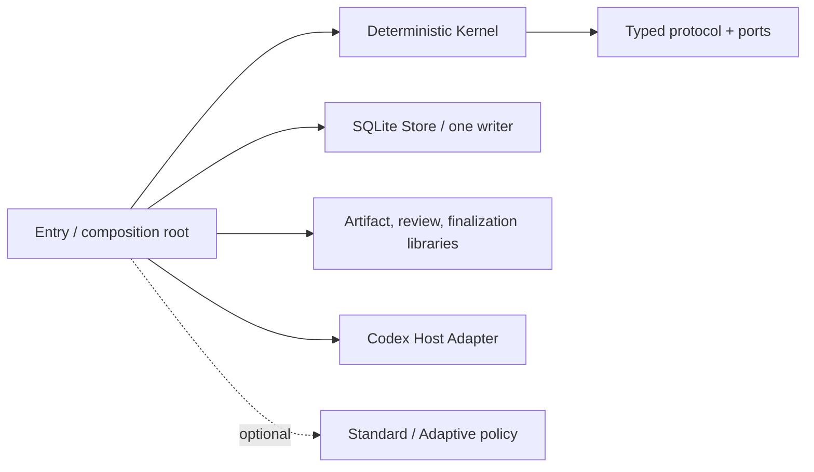

# LoopSkill 4.0

[](https://github.com/amanayayatu-tech/loop-skill/actions/workflows/v4-release.yml)
[](https://github.com/amanayayatu-tech/loop-skill/releases)
[](LICENSE)

[中文](README.md) · [中文快速开始](docs/v4/quickstart.zh-CN.md) · [English quickstart](docs/v4/quickstart.en.md)

<!-- parity: identity -->
> Release status: This source tree is the LoopSkill 4.0.0 stable release. Public availability is established by the `v4.0.0` tag and GitHub Release readback.

LoopSkill turns long-running work into a recoverable loop with explicit authority, evidence, and stop conditions. An ordinary user supplies only a goal or goal file; machines own protocol identities, versions, receipts, and Host readback. The necessary human boundary remains:

`INTAKE → PREPARE → CONFIRM → START`

<!-- parity: break -->
## Breaking-release notice

LoopSkill 4 is a **v4-only hard break**. It preserves validated v3 safety principles, but it does not open, import, repair, or run v3 loops, Controller Packs, MCP state, or CLI data. There is no automatic migration and no dual write.

To keep using old data, independently install or retain [LoopSkill v3.3.8](https://github.com/amanayayatu-tech/loop-skill/releases/tag/v3.3.8). The v4 installer does not modify it.

<!-- parity: changes -->
## What changed in 4.0

- One typed protocol manifest defines command, event, reference, receipt, capability, and error wire shapes.
- The deterministic Kernel depends only on the typed protocol and ports; SQLite Store is the sole canonical writer.
- Artifact, review, finalization, and the Codex Host Adapter remain outside the Kernel boundary.
- Operation IDs, handles, Actor/Grant references, revisions, receipts, digests, and Host identities are machine-generated, parsed, or verified.
- Standard, Adaptive, Reviewer, Local Verifier, Decision Card, and repair are optional policy; the minimal path loads no policy pack.
- An external effect receives at most one automatic attempt; without authoritative readback it honestly becomes `UNKNOWN` or `UNVERIFIABLE`.

<!-- parity: install -->
## 30-second install

Requirements: macOS or Linux, Git, and Python 3.11–3.14. The LoopSkill 4 runtime uses only the Python standard library. Version 4.0.0 may be published only after all eight Linux/macOS × Python 3.11, 3.12, 3.13, and 3.14 release-CI runtime/distribution lanes pass.

```bash
git clone --branch v4.0.0 --depth 1 https://github.com/amanayayatu-tech/loop-skill.git
cd loop-skill
bash scripts/install.sh
LOOPSKILL4="${CODEX_HOME:-$HOME/.codex}/skills/loopskill4/scripts/loopskill4"
"$LOOPSKILL4" --help
```

The distinct installation target is `$CODEX_HOME/skills/loopskill4`. LoopSkill 4 itself does not register MCP, edit `config.toml`, or require a Codex App restart for LoopSkill installation or use. Codex or another product may still require a restart for unrelated reasons.

<!-- parity: usage -->
## Simplest usage

Create `goal.json`:

```json
{
  "goal": "Complete and verify one small change in a disposable example directory",
  "task_horizon": "long",
  "write_scope": ["disposable-example"],
  "budget": "up to 4 minutes; no network or publish",
  "external_actions": [],
  "acceptance_criteria": ["focused tests pass", "result is reviewed"],
  "stop_conditions": ["stop on unknown external state"],
  "authorization_boundaries": ["no commit, push, publish, deploy, or real-user data"]
}
```

Then use one main entry:

```bash
LOOPSKILL4="${CODEX_HOME:-$HOME/.codex}/skills/loopskill4/scripts/loopskill4"
"$LOOPSKILL4" start goal.json
```

The same interaction performs read-only intake, writes local preparation artifacts, and shows the Goal, write scope, budget, external actions, acceptance criteria, stop conditions, and publication boundary. Only exact explicit confirmation can start. A non-interactive session stops at PREPARE; `DIRECT_TASK_RECOMMENDED` creates no loop.

After confirmation, the public entry starts one official foreground `codex exec --json` process. The executable owns its internal thread/turn lifecycle; LoopSkill supplies the confirmed semantic boundary on stdin, captures the machine-emitted identity and terminal JSONL, and never asks the user for Host identity. It registers no LoopSkill MCP and does not require an App restart.

The foreground process is bounded to at most 300 seconds and reaped on success, failure, timeout, or interruption. This is the observation window, not the task budget. A complete stream, zero exit status, final result, and external artifact verification are all required. Lost, malformed, failed, ambiguous, or timed-out evidence becomes `UNKNOWN`; LoopSkill does not resend or run `codex exec resume`.

LoopSkill 4.0.0 therefore supports the ordinary entry only for an individual Host task expected to finish within that observation window. Longer single Host executions are outside this release's public support boundary.

The four phases may also be invoked explicitly:

```bash
"$LOOPSKILL4" intake goal.json
"$LOOPSKILL4" prepare goal.json --output ./prepared-loop
"$LOOPSKILL4" confirm ./prepared-loop
"$LOOPSKILL4" start ./prepared-loop --root ./loopskill4-data
```

<!-- parity: no-control -->
## What ordinary users never provide manually

The number of user-supplied control identities must be zero. Users do not copy task/thread/turn/route/effect/artifact/review/finalization IDs or paste SHA values, receipts, Pack identity, Gateway schemas, MCP/App enums, heartbeat, readback, or retry parameters. Even if model text contains such a value, it receives no authority.

<!-- parity: status -->
## Status, result, and limitations

```bash
"$LOOPSKILL4" status --root ./loopskill4-data
"$LOOPSKILL4" status --refresh --root ./loopskill4-data
"$LOOPSKILL4" status --root ./loopskill4-data --diagnostics
```

Plain status reads only local state. If a crash occurred after the local Attempt commit but before execution ownership was claimed, `status --refresh` may claim that Attempt and perform its one first invocation. Once a process was started, there is no cross-process Host readback or automatic resume: lost terminal evidence remains `UNKNOWN`. It never performs a second spawn or resend. Default status shows only the goal, progress, result, limitations, and actionable next step. Internal identity and receipts appear only in explicit diagnostics. `UNKNOWN` means an external action may have happened but cannot be authoritatively confirmed; `UNVERIFIABLE` means the Host cannot provide the required assurance. Neither is success.

<!-- parity: policy -->
## Optional policies

Standard provides a fixed dependency-ordered Goal Queue. Adaptive provides one active goal and bounded, versioned roadmap revision. Reviewer, Local Verifier, Decision Card, human steering, and bounded repair are optional capabilities. They may submit authorized semantic commands, but cannot write the Store, sign Host receipts, or become a Supervisor.

<!-- parity: architecture -->
## Architecture



Store does not control Host; Artifact and Host do not write canonical state. One state authority may maintain orthogonal aggregate/event streams—it does not imply one giant enum or one physical event stream. See the [architecture map](docs/v4/architecture-map.md), [ADR 0011](docs/adr/0011-loopskill-4-compatible-kernel-refactor.md), and [typed protocol](protocol/v4/README.md).

<!-- parity: safety -->
## Safety and recovery

- Local operation acceptance, per-loop CAS, outbox, and snapshot commit in one SQLite transaction.
- Replaying the same operation ID and request creates no second event, handle, or effect; a changed request returns an idempotency conflict.
- With provider idempotency keys and authoritative readback, the product says only effectively-once.
- Otherwise it promises only at-most-one automatic attempt; a crash or lost response may leave `UNKNOWN`.
- Path traversal, symlinks, case-fold aliases, special files, and open/read races fail closed.
- Artifact correctness, workflow closure, assurance, and external-effect finalization are separate facts and cannot substitute for one another.

<!-- parity: evidence -->
## Evidence boundary

Repository unit, fault-injection, conformance, isolated-install, and disposable foreground Codex exec canary evidence proves only contract behavior for its bound version and scenario. It does not prove patch-success superiority, arbitrary long-horizon efficacy, a fault-free Host, or cross-system exactly-once.

<!-- parity: v3 -->
## v3 hard boundary

When v4 encounters a v3 root, state, or Controller Pack, it performs zero writes and returns stable `USER_UNSUPPORTED_LEGACY_VERSION` with a link to the [v3.3.8 Release](https://github.com/amanayayatu-tech/loop-skill/releases/tag/v3.3.8). v4 ships no importer, repair path, legacy CLI alias, Pack runtime, or v3 MCP State Gateway.

<!-- parity: uninstall -->
## Uninstall and fallback

The installer machine-binds one active receipt; ordinary users do not copy or fill in a receipt:

```bash
python3 "${CODEX_HOME:-$HOME/.codex}/install-receipts/loopskill4/uninstall_v4.py" --codex-home "${CODEX_HOME:-$HOME/.codex}"
```

This digest-bound management entry lives outside the installation target, so the same command is safely repeatable and returns `ALREADY_UNINSTALLED`. The uninstaller resolves and verifies that machine-bound receipt; missing, drifted, or ambiguous evidence fails closed. It removes only the receipt-bound v4 installation and leaves `config.toml` and an independent v3 installation byte-identical. Fallback means uninstalling v4 and continuing to use separately installed v3.3.8; v4 does not restore, convert, or migrate v3 data.

<!-- parity: limitations -->
## Known limitations

- The first release supports only the Codex Host Adapter; a host-neutral Kernel is not a multi-host claim.
- The verified Codex Desktop folder-open → `list_projects` → `projectId` →
  `create_thread` route has 23/23 provisioning receipts, but it is not wired
  into 4.0.0. The default is a cwd-bound foreground `codex exec` invocation;
  Desktop-visible saved projects/tasks are not promised.
- There is no provider idempotency, cross-process lifecycle readback, or
  automatic `codex exec resume` in 4.0.0.
- There is no cross-system exactly-once promise across SQLite, Codex, Git, and network boundaries.
- There is no claim of empirically improved patch success or long-horizon superiority.
- Memory isolation is reported only to the strength the Host can actually attest, which may be unavailable or unverifiable.
- Git/non-Git/new-Git capture runs only inside an authorized root and verified capability.

See [known limitations](docs/v4/known-limitations.md) for the complete list.

<!-- parity: contributor -->
## Development and validation

```bash
python3 -m venv .venv
.venv/bin/python -m pip install --disable-pip-version-check -r requirements-test.txt
.venv/bin/python scripts/generate_v4_protocol.py --check
.venv/bin/python scripts/validate_v4_preservation.py --root . --json
PYTHONDONTWRITEBYTECODE=1 .venv/bin/python -B -W error -m unittest discover -s tests -p 'test_v4*.py' -v
.venv/bin/python -m coverage run -m unittest discover -s tests -p 'test_v4*.py'
.venv/bin/python -m coverage report --fail-under=80
.venv/bin/python scripts/check_v4_docs.py --smoke
```

CI also runs all eight Linux/macOS × Python 3.11–3.14 runtime/distribution lanes, isolated installation, dependency/import-graph, stale legacy runtime, privacy/secret/large-artifact, SBOM/license, and release-identity gates. A result from one local Python runtime cannot substitute for that matrix. The real foreground Codex exec canary is an exact-SHA local release gate; GitHub-hosted runners do not invoke a model.

<!-- parity: release -->
## Release, security, and historical versions

- [v4 release process](docs/RELEASING.md)
- [4.0.0 release notes](docs/v4/release-notes.md)
- [Security policy](SECURITY.md)
- [MIT License](LICENSE)
- [v3.3.8 historical release](https://github.com/amanayayatu-tech/loop-skill/releases/tag/v3.3.8)
- [All GitHub Releases](https://github.com/amanayayatu-tech/loop-skill/releases)
