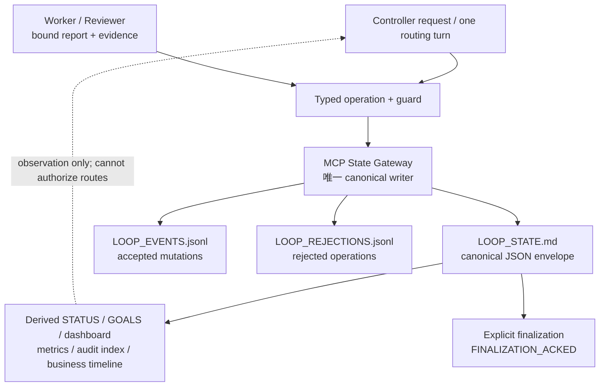
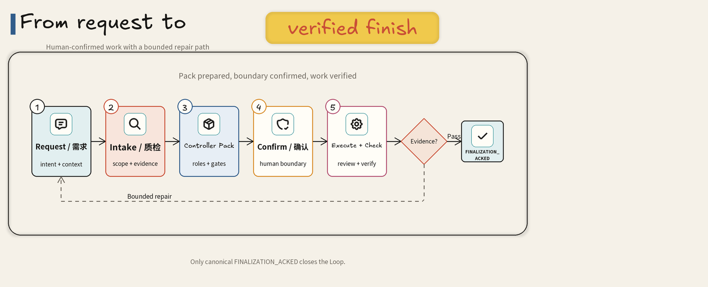
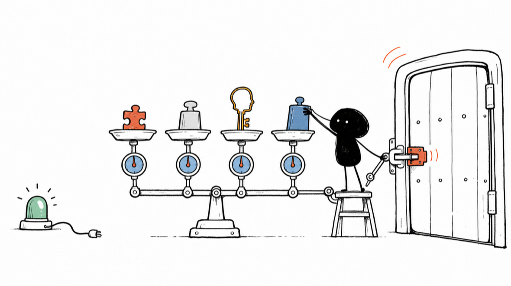

# Codex Loop Prompt Architect

简体中文 | [English](README.en.md)

[](https://github.com/amanayayatu-tech/loop-skill/actions/workflows/compatibility.yml)
[](https://github.com/amanayayatu-tech/loop-skill/releases)

**把一个容易在长对话里失控的复杂任务，变成能交接、能审查、能验证、能明确结束的 Codex App 工作系统。**


聊天会结束，窗口会刷新，任务却未必刚好做完。真正麻烦的长期工作，往往不是“模型不会写代码”，而是范围慢慢漂移、证据散落在多个任务里、失败后重复执行，最后只剩一句“应该完成了”。

`codex-loop-prompt-architect` 为 **Codex macOS App** 设计这种长程任务的 Controller Pack。它先检查需求是否真的适合进入 Loop，再把目标、角色、权限、证据、修复上限和完成条件写成可验证的工作契约。

它负责**设计 Loop 和生成 Pack**，不会替你直接实现目标项目，也不会仅凭一句调用就自动启动无人值守任务。

## Loop、状态机与 Graph：LoopSkill 到底是什么

LoopSkill 是一个**受治理、证据绑定的执行与完成控制面**：外层由连续的 Controller turn 驱动，内部用持久化 canonical state、受类型约束的操作、guard、ledger、lease、outbox、证据绑定和确定性恢复来约束长程工作。它因此具有明确的状态机与 Graph 语义，但刻意不提供任意 DAG 编排能力，也不是通用 Graph workflow runtime。

当前没有一份独立的 node/edge DSL 或统一 Graph definition 文件。允许的节点、转移和失败恢复边，由 schema、runtime validators、Goal dependency 与 recovery registry 共同定义：

| LoopSkill 实体 | 状态机 / Graph 语义 | 当前真实作用 |
| --- | --- | --- |
| Goal registry / Goal queue | 节点集合与依赖关系 | 定义允许执行的业务目标、依赖和顺序 |
| canonical state version | 图状态与版本 | 通过 CAS/freshness 防止陈旧结果推进当前状态 |
| typed runtime operation | 有类型的边 / 转移 | Controller 只能请求 runtime 允许的操作 |
| guard / validation / evidence freshness | 边的 guard | 证据、权限、版本或身份不满足时拒绝转移 |
| Controller lease / routing turn | 单次调度权 | 防止同一 Controller turn 重复路由 |
| outbox | 待执行边的持久化意图 | 支持发送崩溃、丢失输出和幂等恢复 |
| Worker / Reviewer report | 节点产物与验证结果 | 绑定当前 dispatch、artifact、diff 和证据 |
| recovery registry | 失败边与合法恢复边 | 每个 recoverable code 映射一个合法 next operation |
| finalization | 显式终态转移 | 只有 canonical `FINALIZATION_ACKED` 才闭环 |
| heartbeat / human decision | 定时唤醒与人工 interrupt | 支持观察、暂停、恢复和人工闸门 |

下面的图描述当前 **Adaptive schema v3** 执行路径：



`.codex-loop/LOOP_STATE.md` 虽然使用 Markdown 文件扩展名，但内容是严格 JSON envelope，而不是任意自然语言笔记；它是唯一 canonical state。Adaptive schema v3 只能由 MCP State Gateway 写入；Standard 与 legacy Adaptive Pack 仍使用其受约束的单 State-Writer 路径，两类 writer 不会同时成为 canonical authority。Controller、Worker 和 Reviewer 在任一路径中都不得直接编辑 canonical。`.codex-loop/LOOP_EVENTS.jsonl` 追加 accepted canonical mutation；独立且 hash-chained 的 `.codex-loop/LOOP_REJECTIONS.jsonl` 追加 rejected operation，并排除 raw prompt、聊天、凭据和完整请求。

`STATUS.md`、`GOALS.md`、dashboard、metrics、`audit-index.json`、按 Goal 汇总和 `business-timeline.json` 都是 canonical state 的确定性派生投影。它们适合人类阅读、Git diff、观察和恢复辅助，但不能反向授权路由或成为第二 canonical；发生冲突时，以 canonical state 与 transaction journal 为准。新 projection、report 和 staging 写入使用 SHA-256 内容寻址与去重，同时保留历史 facade 的读取兼容。这不是把 Markdown 当成无约束并发数据库：并发正确性来自单 canonical writer、state version、CAS、lease、outbox、PREPARED/APPLIED journal、digest 和 schema validator。Markdown envelope 的价值是可读、可审查、易于 Git diff 和归档，也便于在聊天、任务或 App 重启后恢复上下文。

**Standard 与 Adaptive。**Standard Loop 使用依赖有序的固定 Goal Queue，拓扑接近预定义的线性或有限分支状态机，适合目标与顺序稳定的任务。Adaptive Loop 保持一个 Active milestone，允许后续路线依据新证据进行受审计的 roadmap revision；模型不能任意改写目标，Goal registry、repair budget、capability 与完成标准仍受 canonical 约束。两者都坚持单 canonical writer、一次 Controller turn 一条正式 route、有界 repair、显式 review/audit/finalization、lost-output recovery，以及证据身份变化后旧 review 不得复用。

**边界。**LoopSkill 当前不把任意动态 DAG authoring、无限制并行 fan-out/fan-in、多 Worker 并发写同一 canonical state、任意节点独立 checkpoint/时间旅行、多分支通用确定性 merge、跨机器分布式调度作为一等产品承诺，也不取代 LangGraph、Temporal、Airflow 或 CI 系统。这是可靠性取舍：它优先解决 Codex 长程任务中的 scope drift、重复派发、证据陈旧、修复循环、崩溃恢复、人工暂停和错误宣布完成。

## OpenAI Build Week 2026

LoopSkill 在活动开始前已有基础版本，并在 2026 年 7 月 13–17 日使用 **Codex 和 GPT-5.6** 完成了实质性扩展。Codex 是这轮工作的主要工程环境，GPT-5.6 用于实现、事故分析、测试设计、文档、审查与发布加固。

Build Week 期间新增或强化了双语上手路径、可演进的项目规范及校验器、分片兼容性 CI、类型化 MCP 运行时载荷、历史状态修复保护，以及对不可用原生 Goal 恢复路径的 fail-closed 退役。公开提交历史记录了这段期间的 **75 个提交、102 个变更文件**，并收束于 [`v3.2.8`](https://github.com/amanayayatu-tech/loop-skill/releases/tag/v3.2.8)。

## 30 秒 Quickstart

要求：macOS、Codex App、Git、Python 3.9+。

```bash
git clone https://github.com/amanayayatu-tech/loop-skill.git
cd loop-skill
python3 -m venv .venv
.venv/bin/python -m pip install -r requirements-test.txt
./scripts/install.sh
```

如果已安装的 `codex-loop-state` 正好仍指向同一 skill bridge，安装器会保留
那个已登记的绝对 Python runtime 并原子替换 skill；不同 bridge、额外执行字段或
失效 runtime 一律保持冲突并回滚，不能用手改 config 绕过。

安装后，在 Codex App 中新建一个任务。先做只读需求质检：

```text
使用 $codex-loop-prompt-architect 的 intake-only 模式。
检查下面的需求是否适合进入 Loop，只问最优先的缺口，不生成 Controller Pack：
……
```

准备好后，再生成 Pack：

```text
使用 $codex-loop-prompt-architect 把下面的长期任务设计成 Loop。
先运行 Intake Gate；信息不足时先问我，READY_FOR_LOOP 后再生成 Controller Pack：
……
```

然后按三个明确步骤开始：

1. **Skill 生成 Pack**：得到一个自包含的 Controller Pack Markdown 和一份独立的中文使用说明。
2. **你确认边界**：检查目标、写入范围、预算、外部动作、验收标准和停止条件。
3. **你启动真实 Loop**：在 Codex App 中创建一个真实 Controller 任务，把 Pack 作为启动输入；只有这一步才开始实际编排。

如果 Intake 返回 `DIRECT_TASK_RECOMMENDED`，直接让 Codex 完成任务通常更快。Loop 不是每件事都需要的仪式。

## 正式长程 Loop 的启动闸

每个新会话第一次进入 intake 或 generate 前，Skill 会先运行只读 doctor。也可直接检查：

```bash
scripts/loopctl doctor --check --json
scripts/loopctl compile --input loop-source.json --check --json
scripts/loopctl canary --input compiled-manifest.json --json
scripts/loopctl audit --root /absolute/loop/root --json
scripts/loopctl metrics-export --root /absolute/loop/root --json
scripts/loopctl archive --root /absolute/loop/root --reason "closeout" --check --json
scripts/loopctl risk-scan --root /absolute/project/root --check --json
```

`doctor` 检查实际 Python 解释器与依赖、Git/worktree、source/install manifest、MCP 配置和 schema，以及 App/宿主能力。receipt 以这些身份的 digest 缓存；任何一项变化都会失效。失败只返回明确错误和修复命令，不创建 canonical、角色或 heartbeat。`compile` 默认生成 disposable CP0；正式初始化还必须绑定完整 registry、task/thread 与 heartbeat readback、五类 MCP lifecycle receipt，以及覆盖初始化至 `FINALIZATION_ACKED` 的真实 disposable canary。只有显式要求 `required_model` 或 `required_reasoning` 时才强制宿主 model receipt。canary 的每个 lane 和 lifecycle receipt 都必须绑定 manifest 并通过自身 digest 校验；formal startup receipt 由 MCP Gateway 从 root 内的 source path materialize，不能由调用参数内联伪造。

App 重启后，只读 MCP `host_lifecycle_readback` 从已校验的安装 receipt、当前精确 server 注册、OpenAI 签名的 App 父进程及当前 server/client/schema 身份生成五类 lifecycle receipt。active-call 数由串行 stdio dispatcher 自己计数并排除当前 readback 调用；模型不能传入或自签 `0`。安装漂移、未观察到重启、并行调用或 App build 不可读都会 fail closed。

运行时的可恢复错误全部由统一 recovery registry 映射到唯一 next operation，不能只返回 `WAIT`。拒绝操作另写入 hash-chain、append-only、fsync 的 `.codex-loop/LOOP_REJECTIONS.jsonl`；其中只保留请求 digest 和最小审计字段，不保留 prompt、聊天、凭据或完整请求。这里的“零副作用”指零 canonical、产品和外部副作用，审计 journal append 是显式允许的审计副作用。

正式 Goal 可要求 Git closeout saga：`PREPARE_GOAL_CLOSEOUT` 锁定 reviewed artifact、HEAD、branch、路径和一次性 capability；commit/push 后由 Git readback 执行 `ACK_GOAL_CLOSEOUT`。`NO_COMMIT` 只在 HEAD 未漂移且 worktree/index 完全干净时合法。崩溃恢复复用原 closeout 记录，HEAD 漂移、路径越界或 remote ref 不一致均拒绝。policy migration 使用通用 descriptor 和完整历史；旧 repair-budget effect 保持兼容。STATUS/dashboard 从 `status-v5` 起同时显示 workflow 状态与证据完成类别：`COMPLETE_ARTIFACT`、`COMPLETE_WITH_LIMITATION`、`EMPIRICAL_RESULT_OBSERVED`、`FORMAL_ACCEPTED` 或 `PUBLIC_RELEASED`。

## P1 效率与治理运行时

新 Loop 可在编译源中显式启用 `p1.enabled=true`。启用后，disposable registry 只能包含 `D0-control-plane-self-test`；formal manifest 必须一次声明完整 Goal registry，并为 Controller、Worker、Reviewer 提供代表性 model-canary receipt。默认仍不固定具体模型；只有 `required_model` / `required_reasoning` 的严格模式要求宿主身份 receipt。

P1 canonical runtime 会把 defect family、同轮 sibling/unchecked-surface 披露、heartbeat identity、route orchestration、latency 与干预计数写进同一个状态子文档。Reviewer 第三次返回同一 defect family 时，普通 point repair 会被拒绝，只能选择 `REFACTOR`、`GOAL_SPLIT`、`CLAIM_NARROWING` 或 `LIMITATION`。repair route 还必须通过结构化 Supervisor capability envelope；自然语言授权不能扩大权限。

`PREPARE → send → RECORD` 的 orchestration 只合并确定性编排，不伪装成网络原子事务。每次外部 send 保留独立 receipt；崩溃重放从最后一个已确认步骤恢复，不能重复外部动作。heartbeat registry 是 automation ID、target、RRULE、prompt digest 与 status 的唯一事实源，readback 漂移会 fail closed。

`metrics-export` 只输出计数、latency、`UNMETERED` 值及 runtime/config/model digest。它不会输出 prompt、聊天、task/thread ID、路径、PII、秘密或 raw log。CI 的 recovery coverage 以 AST 枚举 runtime、MCP、CLI 与 codec 边界；当前每个可达 code 都必须有唯一、非 `WAIT` 的 next operation。

## P2 可运维性与历史治理

新写入的 projection、report 和 report staging 现在以 SHA-256 内容寻址；原有路径仍作为兼容 facade 可读，相同权限类别的重复字节只保留一个对象。旧布局不会被批量改写或删除。运行时同时生成轻量 `audit-index.json`、按 Goal 汇总和业务时间线，dashboard 把业务 route/Goal 与控制面 mutation 分开显示。

所有 runtime、MCP 和 `loopctl` 错误 envelope 都从 recovery registry 给出可复制的 `next_operation_template`。`loopctl` 子命令统一接受 `--check`、`--emit`、`--json` 和稳定退出码；旧 `compile --emit PATH` 保留一个兼容周期。`risk-scan` 区分 SHA-256、placeholder、fixture 和真实 credential，allowlist 必须绑定规则 ID、文件范围、类别和原因，输出只保留命中值 digest。

新归档使用 `archive-manifest-v2`，记录原因、root、Git、state、events、outboxes、roles、heartbeat、文件 digest 与隐私分类；两种旧 manifest 继续只读兼容。active prompt 只读取 active policy，历史 model/heartbeat 文字保留为 evidence 但不能重新进入 prompt。CI 保留现有 required final gate，并增加结构化 path class、四分片 P50/P95/最慢测试、分层 fuzz profile，以及最近五个 main merge 的 observation-only shadow replay。

## 先质检，再 Loop 化

### 正确调用方式

- `intake-only` 只做只读需求质检，返回完整稳定的七段式报告；达到 `READY_FOR_LOOP` 时会在第 7 节附经过
  校验的 `LOOP_INPUT_JSON`，但不生成 Controller Pack。
- `generate` 运行同一个 Intake Gate；只有 `READY_FOR_LOOP` 和真实 `--check-only` 都通过后，才生成 Pack。
- 同一任务可以沿用已确认事实；已经明确的答案不会被机械地重复询问。
- 新任务不会自动继承上一任务。需要继续时，请带上完整 `LOOP_INPUT_JSON` 或原始需求与已确认边界。

### 不应使用的调用

- 不要调用 `$loop-readiness-gate`：Skill 名称不存在，仓库里也没有第二个 `$loop-readiness-gate` skill。
- 不要把 `NEEDS_CLARIFICATION`、`BLOCKED` 或 `DIRECT_TASK_RECOMMENDED` 改写成“带假设就绪”。
- 不要让 intake-only 创建 Pack、启动 Loop、创建角色任务或 heartbeat。

唯一 Intake 公共合同是 [references/loop-intake-gate.md](codex-loop-prompt-architect/references/loop-intake-gate.md)，对应回归在 [test_loop_intake_gate.py](tests/test_loop_intake_gate.py)。

## 它会做什么



一条准备充分的 Loop 通常经历：

1. **Request**：收集目标、范围、来源、限制和“什么算完成”。
2. **Intake Gate**：区分可补充的信息、硬阻塞和更适合直接执行的小任务。
3. **Controller Pack**：生成角色、Goal、权限、证据、重试、repair 与 finalization 契约。
4. **Human Confirm**：由用户确认真正允许的控制面和产品副作用。
5. **Execute / Review / Verify**：真实 Worker 执行，Reviewer 审查精确产物，必要时由 Local Verifier 验证本机事实。
6. **Bounded Repair**：修复有明确上限；耗尽后暂停或停止，不机械空转。
7. **Finalization**：只有 canonical `FINALIZATION_ACKED` 才表示 Loop 闭环。

你最终得到的不是一段“更长的提示词”，而是一套可发送给 Controller 的工作包：

- 一个自包含的 `<project>-codex-loop-controller-pack.md`；
- 一份告诉你如何启动、观察、暂停和判断异常的中文使用说明；
- Standard 的固定 Goal Queue，或 Adaptive 的里程碑路线图与 canonical 状态契约；
- 明确的角色、权限、证据、预算、重试、repair、STOP 和完成边界。

## 适合与不适合

适合：

- 会跨越多轮对话、多个真实 Codex App 任务或半天以上的复杂工作；
- 需要 Worker、Reviewer、MCP State Gateway 与 Local Verifier 分工；
- 需要精确限制写入、push、外部调用、付费资源或本机验证；
- 结果必须绑定具体 artifact、测试、身份和审查证据；
- 后续路线可能因新证据改变，但历史不能被抹掉。

不适合：

- 一个任务、一小段修改、一次明确查询就能完成的工作；
- 没有可判断的验收标准，却希望“让它自己想办法一直做”；
- 需要绕过审批、秘密边界或第三方系统权限的操作；
- 把 Loop 当成绝对可靠、永不失败或完全无人值守的承诺。

## Standard 与 Adaptive

| | Standard | Adaptive |
| --- | --- | --- |
| 适合 | 目标和顺序已经稳定 | 多里程碑，后续计划会被证据影响 |
| 路线 | 固定、依赖有序的 Goal Queue | 一个 Active milestone + 可审计 Roadmap Revision |
| 状态 | 版本化状态与事件 | 确定性 runtime、lease、outbox、投影与完整审计链 |
| 选择方式 | READY 输入默认使用 | 明确指定，或任务复杂度满足 Adaptive 条件 |
| 共同边界 | 真实任务身份、Controller 只读、串行 canonical 写入、有限 repair、逐 Goal 审查、最终审计 | 同左 |

输出详细度 `compact` / `full` / `minimal_patch` 与协作模式 `standard` / `adaptive` 是两条独立轴，不要混为一谈。

## Adaptive v3.3.8：谁写状态、谁推进路线

新生成的 Adaptive Pack 默认使用 schema v3。它不再创建会话式 State-Writer 任务；已安装的 MCP `state_gateway({root, request})` 是唯一 canonical writer。Controller 仍然只读，Worker 只做产品工作，Reviewer/Local Verifier 只提交证据，任何外层 Supervisor 都不属于产品角色。

v3.3.8 起，Gateway Pack 会携带唯一、可提取且可重算摘要的 heartbeat 正文；生成、`--check-only` 和发布校验共同拒绝缺失或摘要不匹配的正文，避免运行时自行猜测 automation prompt 字节。

**当前平台边界：**schema v3 是 **host-cooperative evidence**，不是声称防御“恶意 Controller 可伪造全部 App 调用”的 Byzantine 系统。Gateway 将一次真实 App 的 task/thread、automation、send 返回 target 或 PAUSED readback，绑定到当前 host-attested turn、唯一 PREPARED outbox 和已登记 heartbeat；由 Gateway 自己取得 canonical payload digest，且 send observation 本身绝不产生 PASS。它防止崩溃、重复发送、陈旧/错配/重放报告、错误 artifact/dispatch 与误终态。默认 Loop 不固定具体模型：`model_identity_requirement=NOT_REQUIRED`、`model_identity_status=NOT_APPLICABLE`，model/reasoning 只记录为 `UNSPECIFIED`，不会暗示已验证身份。只有 manifest 或 Goal 显式声明 `required_model` / `required_reasoning` 时，才启用严格身份闸；此时 App 必须在非参数 `_meta.x-codex-app-action-receipt-v1` 中注入 `THREAD_CREATE_OR_READ` 收据，宿主不支持则 `HOST_BLOCKED`。当前 v1 只接受准确标记为 `HOST_COOPERATIVE` 的宿主注入证据；普通 digest 不得冒充 `APP_SIGNED`。

```text
Controller (read-only)
  -> State Gateway: PREPARE_ROUTE
  -> runtime_codec: MATERIALIZE_DISPATCH
  -> App send once -> RECORD_ROUTE_SENT
  -> role-owned STAGE_REPORT -> ACK_ROUTE_RESULT
```

Worker 的正式 PASS 若引用本轮验证文件，会在同一次 target-owned
`STAGE_REPORT` 中传入这些文件的精确路径、SHA-256 与 media type。runtime
只从已登记 Worker 的 worktree 读取字节，先写入不可变 staging；Gateway
随后把这些字节与正式报告原子归档到原 outbox。证据缺失、错 digest、错
线程、未被报告引用或陈旧 artifact 都会零副作用拒绝。Controller 不复制
测试输出，也不能用 send receipt 代替验证证据。每份报告最多引入 15 个
验证文件；任何大小写形式的 `.codex-loop/**` 控制面来源都被拒绝。

Gateway 从 canonical state 原子取得 lease、仓库快照、freshness、validation matrix、review handoff、当前 artifact 与 outbox；Controller 不复制这些对象。PASS 投影同时要求同一 Goal 的**当前 artifact + 当前 Worker dispatch + PASS 正式报告**。`BLOCKED`、旧 artifact 或旧 dispatch 不能越级成为 PASS。

真实用户 Decision Card 也只通过 Gateway：`REGISTER_DECISION` 从当前
canonical 派生 source version 与 context digest；`RECORD_DECISION_RESPONSE`
把选择绑定到当前 host-attested Controller turn，并只保存摘要与规范化响应
digest。对必需浏览器 review surface，实际预览端口可因本机占用而变化，
但仅允许同一 loopback 主机、协议与路径且无凭证/query/fragment；Goal、
Worker dispatch、artifact、配置 URL 和实际 URL 仍共同进入决策上下文。
错误选项、陈旧 artifact、错路径或重放响应均零副作用拒绝。

Worker PASS 后固定经过 Code Review、必要的 Local Verification、Roadmap Audit。非最终的 audit PASS 只能由 `ADVANCE_ROADMAP` 在既有 canonical registry 内推进；最终候选还要经过 Final Audit、`PREPARE_FINALIZATION`、一次真实 `automation_update` pause 与 PAUSED readback、`ACK_FINALIZATION`，才到达 `FINALIZATION_ACKED`。schema v3 禁用 native Goal adapter，记录会明确写出本地 `GATEWAY_NO_NATIVE_GOAL` sentinel；它不是外部 Goal 工具 receipt。Gateway 不会自行制造 heartbeat `PAUSED` 证据，也不接受不匹配当前 heartbeat 的 Controller JSON。目标 Worker/Reviewer/Verifier 每次 MCP-attested stage 成功后，runtime 会按 SENT outbox 与 report digest 写入只读 target-stage sidecar；Controller 只可派生读取并验证该证明，不能从参数转交或伪造。报告已 staged 但 stdout 或任务索引丢失时，用 `REPORT_RECOVERY` ACK 原 outbox，不创建第二个“补报告”的产品派发；同一目标角色重新 stage 即可恢复跨 bridge 的证明。

schema v1/v2 与 `route_state_mutation` / State-Writer 只保留兼容读取和显式 `MIGRATE_V2_TO_V3`。迁移只能在 PAUSED、无 lease、无活跃 outbox 的安全点进行。终态 predecessor 永久保留；续跑只能在新 root 使用 `INITIALIZE_SUCCESSOR`。

## 如何读“慢”、传输退化与终态

- **正常慢**：同一 SENT outbox 仍有活跃角色或新证据；观察同一条路线，不重复派发。
- **传输退化**：真实注册 heartbeat 的同一 outbox/fingerprint 失败，会绑定当前 host turn 后进入 canonical；第一次失败仍保留原 outbox；两次自然 heartbeat 或累计 15 分钟后进入 `WAITING_TRANSPORT_RECOVERY`。canonical 立即停止路由；`ACK_TRANSPORT_PAUSE` 必须有真实 pause 后、精确匹配该 heartbeat 的 PAUSED readback。原 outbox 完成或恢复后，只有同一个 heartbeat 的真实 ACTIVE update/readback 才能由 `ACK_TRANSPORT_RECOVERY` 原子恢复 `RUNNING`；它不会新建 dispatch、增加 repair 或自行产生 PASS。若 ACK 拒绝，按拒绝后的 canonical 分类：仍 WAITING/PAUSED 才重新 pause；已 HEALTHY/RUNNING 则只读回状态且不得 pause；状态不可读时先协调一致，期间禁止路由。
- **真正终态**：只有 canonical `FINALIZATION_ACKED`，或有独立硬阻断证据的 `LOOP_BLOCKED`。投影的旧 `RUNNING` 字段不能复活终态。

`LOOP_METRICS.json` 是派生观察：按 Goal 展示总时长、彼此分开的已观测 Worker/Reviewer/Local Verifier 窗口、控制面等待、派发/审查/拒绝次数、消息故障、Steering 和可得 token 使用。它不是第二 canonical，也不能授权路由。

## 一个短而完整的例子

假设你要为已有 Web 项目增加 Passkey 登录，并要求代码、迁移、浏览器行为和安全审查全部可追溯。

你可以这样说：

```text
使用 $codex-loop-prompt-architect 把 Passkey 登录需求设计成 Standard Loop。
代码只允许写入 app/auth/** 和 tests/auth/**；禁止 push、merge、deploy 和生产写入。
完成必须包括单元测试、浏览器验证、代码审查和最终集成审查。
信息不足时先进入 NEEDS_CLARIFICATION，不要替我补权限。
```

Intake 会先检查项目位置、repo 模式、现有实现、验收条件、权限和本机验证需求。只有达到 `READY_FOR_LOOP` 且 scaffold `--check-only` 通过，才会生成可投递 Pack。

真实运行时，Worker 不会因为“代码写完”就解锁下一步。它的精确产物先进入 canonical 记录，Reviewer 审查对应 diff，本机事实按需要交给 Local Verifier；如果 repair 改变 artifact，旧审查不能沿用。最后还要做完整审计和 finalization。

## 为什么结果更可信



可信不是因为界面亮了绿灯，也不是因为某个角色说“完成”。它来自几条用户能感受到的约束：

| 用户得到的收益 | 背后的机制 |
| --- | --- |
| 不会把旧结果当作新修改的证明 | 审查和验证绑定精确 artifact、命令、环境与配置身份 |
| 网络或工具输出丢失时不盲目重做外部调用 | durable receipt 区分 STARTED / COMPLETED，并禁止丢 stdout 后自动重发 |
| 两个 Controller turn 不会同时推动同一条路线 | canonical lease、真实 App turn 绑定和 one-route-per-turn |
| 状态冲突不会靠模型“猜一个正确版本” | deterministic runtime、CAS、journal、outbox 和幂等回放 |
| 修复不会无限循环 | 初次执行之外的 repair 有硬上限，耗尽后暂停、决策或 STOP |
| “完成”有唯一可核验的门 | v3 的 `PREPARE_FINALIZATION` 还不算结束；只有 `FINALIZATION_ACKED` 闭环 |

真实身份不能靠模型自报、任务标题、环境变量或随机 UUID 证明。Adaptive 路由只接受宿主提供并经过校验的 App 元数据和进程身份；无法证明时 fail closed。

## 安全与权限边界

生成 Pack 不会静默授权：

- push、merge、deploy、发布、生产写入；
- 外部系统写入、付费 provider、秘密或凭据使用；
- destructive 操作、扩大文件范围或创建额外基础设施；
- 把本地测试、GitHub 绿灯或历史 smoke 提升成当前版本发布 PASS。

发送经过确认的 Pack，只授权其中明确声明的、有界的控制面动作，例如创建约定的真实角色任务、发送规定消息和维护同一个 heartbeat。它不自动扩大产品写权限，也不替代 push、merge、deploy、付费调用和外部写入的显式授权。

只读 Intake 不修改产品仓库、canonical 状态、任务、Goal 或 heartbeat。它最多在临时目录中构造一次 disposable generator 输入，用于 `--check-only`。

旧证据不能解锁新产物。artifact、代码、配置、App build、Pack 或安装身份变化后，依赖这些身份的审查与兼容性证据必须重新取得。

## 当前限制

### Native Goal generation recovery：`DEFERRED_UNAVAILABLE`

v3.2.8 不提供丢失 native Goal identity 后的自动恢复。当前 Codex App 没有能在同一身份下完成 create-paused、resume、restore 或 rebind 的公开接口，因此生成 Pack 不包含这条恢复流程。v3.3 schema 的新 Pack 更进一步禁用 native Goal adapter；下面的 required-mode 说明只适用于仍可读取的 v1/v2 兼容状态。v3.2.7 只合入过仓库 `main`，从未创建 tag 或 GitHub Release；其停做决定由 v3.2.8 正式收口，Git 历史保持不变。

旧 CLI/MCP recovery 入口会以 `NATIVE_GOAL_GENERATION_RECOVERY_UNAVAILABLE`、`side_effects=NONE` 拒绝。required 模式发现 `NATIVE_CONTROLLER_GOAL_IDENTITY_LOST` 时，canonical 状态保持不变，同一 heartbeat 保持暂停，不创建替代 Goal、Controller、thread、session 或 heartbeat。历史 BLOCKED receipt 仍是 BLOCKED 证据，不能改写成 PASS。

### App 消息与进程传输

新生成的 Adaptive Pack 通过已安装的 MCP `runtime_codec` 传递结构化参数，覆盖 dispatch materialize/verify、正式报告与外部 receipt staging、fingerprint normalization 和 `CAPTURE_COMPLETE_DIFF`。它不再假设 `tty:false` 子进程启动后仍会暴露可供后续 `write_stdin` 使用的 session stdin。二进制 Git patch 由 runtime 原始捕获、反向 apply 校验并写入 manifest；Worker PASS 只能引用 digest-only 的 `CAPTURED_GIT_DIFF_V1`，由 runtime 推导并重验 capture 路径，模型不搬运 patch bytes 或 `.codex-loop` 路径。

CLI stdin 只为旧 State-Writer 和兼容调用保留。输入在首帧前关闭时返回 `INPUT_TRANSPORT_EOF_BEFORE_FRAME`；codec 工具不存在时返回 `RUNTIME_CODEC_TOOL_UNAVAILABLE`。两者都必须零副作用停止，不能改用 PTY、heredoc、管道或手工 digest 绕过。

### App 与协议身份

这是面向 Codex macOS App 的 skill，不宣称支持所有平台，也不宣称修复 Codex app-server 的进程回收或 Goal 持久化。

真实 App receipt 会分别记录可观察的 client/server 协议信息。如果宿主没有公开 negotiated MCP protocol version，必须写成：

```text
negotiated_protocol_version_status = UNAVAILABLE_BY_HOST
negotiated_protocol_version = null
```

这表示“宿主未提供”，不是“已经验证”。只要连接、身份、route、零副作用、receipt 和 finalization 等独立门全部通过，该未知字段本身不单独阻止发布。

## Intake 结果

- `READY_FOR_LOOP`：适用门全部通过，真实 scaffold `--check-only` 成功。
- `NEEDS_CLARIFICATION`：用户可以补充事实、约束或权限。
- `BLOCKED`：存在硬可行性、安全、资源或授权冲突。
- `DIRECT_TASK_RECOMMENDED`：需求清楚，但不值得承担 Loop 成本。

不存在 `READY_WITH_ASSUMPTIONS`。未知事实保持 `UNKNOWN`，建议默认值也必须先确认。

## 脚本化生成

只检查输入：

```bash
python3 ~/.codex/skills/codex-loop-prompt-architect/scripts/loop_prompt_scaffold.py \
  --input examples/01-passkey-login-input.json \
  --check-only
```

生成 Pack 和使用说明：

```bash
python3 ~/.codex/skills/codex-loop-prompt-architect/scripts/loop_prompt_scaffold.py \
  --input examples/01-passkey-login-input.json \
  --controller-pack-output /tmp/controller-pack.md \
  --user-guide-output /tmp/usage.md
```

生成 Full Mode：

```bash
python3 ~/.codex/skills/codex-loop-prompt-architect/scripts/loop_prompt_scaffold.py \
  --input examples/03-adaptive-passkey-input.json \
  --mode full \
  --controller-pack-output /tmp/adaptive-controller-pack.md
```

查看输入 schema：

```bash
python3 ~/.codex/skills/codex-loop-prompt-architect/scripts/loop_prompt_scaffold.py \
  --print-schema
```

生成器默认拒绝不完整或含重复 JSON key 的输入。只有明确需要不可投递草稿时才使用 `--allow-draft`；草稿会标记 `NON_DISPATCHABLE_DRAFT`。

仓库模式：

- `existing_git`：先核对 root、branch、base SHA、dirty、remote 和 worktree。
- `new_git`：由第一个获授权的 Worker 初始化 Git；初始化与建分支分别授权。
- `non_git`：用 before/after manifest、内容 digest 与 diff digest 代替虚构 Git 身份。

## 三个案例

- [Passkey 登录（Standard）](examples/01-passkey-login-input.json)
- [Daily CI Triage（Standard）](examples/02-daily-ci-triage-input.json)
- [Adaptive Passkey](examples/03-adaptive-passkey-input.json)

<details>
<summary><strong>验证与证据边界</strong></summary>

快速本地回归：

```bash
.venv/bin/python -m pip install -r requirements-test.txt
.venv/bin/python -W error -m unittest discover -s tests -v
.venv/bin/python codex-loop-prompt-architect/scripts/validate_skill.py
bash -n scripts/install.sh
```

完整发布流程还包括全部 shipped Python 的 branch coverage、两组独立 5000-case fuzz、隔离安装/回滚、source/install 零漂移、安全检查和同一 exact SHA 的真实 App canary。v3 canary 还必须证明：没有 State-Writer 任务、Gateway 的 one-route-per-turn、丢 stdout 后原 outbox 恢复、transport 暂停、successor handoff 和 `FINALIZATION_ACKED`。当前主 Mac 的结构化 receipt 使用 `evidence_layer=local-main-mac`。

GitHub Actions 只是兼容性镜像，不是发布验收。历史 E2E 也只是其记录机器、App build 与 artifact 的 bounded smoke，不能证明跨版本、生产、长跑或公开验收。完整顺序见[发布流程](docs/RELEASING.md)，历史边界见[证据索引](evidence/README.md)。

</details>

## 深入了解

- [项目规范与安全演进规则](SPEC.md)
- [Skill 指令](codex-loop-prompt-architect/SKILL.md)
- [Intake Gate 合同](codex-loop-prompt-architect/references/loop-intake-gate.md)
- [Standard Loop 合同](codex-loop-prompt-architect/references/loop-contract.md)
- [Adaptive Loop 合同](codex-loop-prompt-architect/references/adaptive-loop-contract.md)
- [Human Steering 与收敛](codex-loop-prompt-architect/references/human-steering-and-convergence.md)
- [发布流程](docs/RELEASING.md)
- [版本记录](CHANGELOG.md)
- [历史证据索引](evidence/README.md)

## 许可证

MIT. See [LICENSE](LICENSE).
