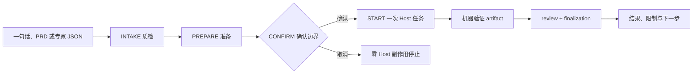
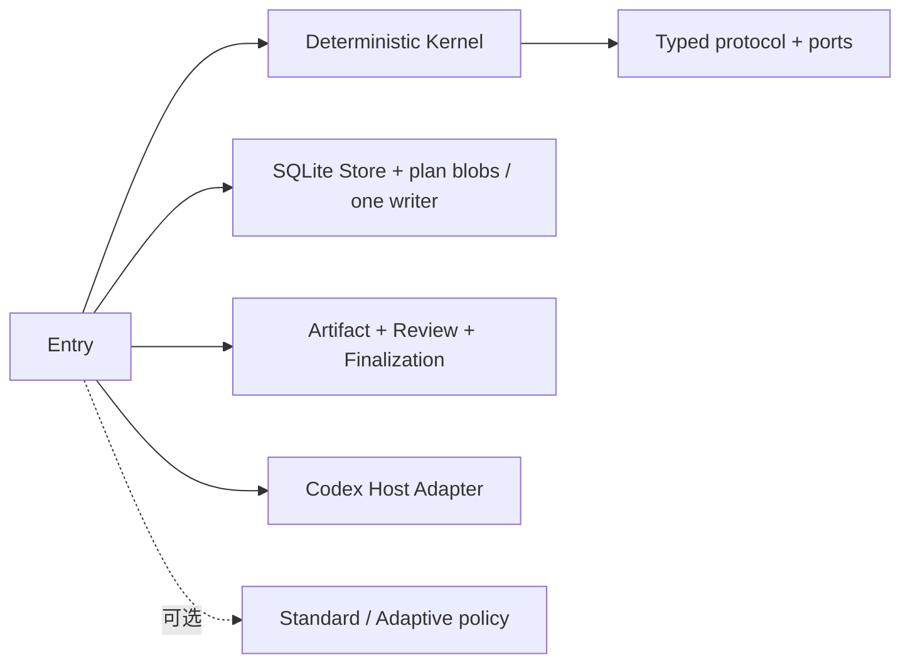

# LoopSkill 5 Skill / LoopSkill 4.2 runtime

[](https://github.com/amanayayatu-tech/loop-skill/actions/workflows/v4-release.yml)
[](https://github.com/amanayayatu-tech/loop-skill/actions/workflows/v5-release.yml)
[](https://github.com/amanayayatu-tech/loop-skill/releases)
[](LICENSE)

[English](README.en.md) · [5.0 中文快速开始](docs/v5/quickstart.zh-CN.md) · [5.0 English quickstart](docs/v5/quickstart.en.md) · [5.0 release notes](docs/v5/release-notes-v5.0.0.md)

本仓库承载两个独立产品身份：当前的 LoopSkill 5 是 Codex 中的自然语言 Skill，安装内容严格只有 `loopskill5/SKILL.md` 与 `loopskill5/agents/openai.yaml`；保留的 LoopSkill 4.2 是独立 Python runtime。根 `VERSION=4.2.0` 与 `scripts/install.sh` 只属于 v4，不是 v5 的版本或安装入口。

LoopSkill 5 帮你在一次 START 前主动调查真实环境、给出能延长无人值守跨度的建议，并展示 12 项人类可读 Launch Contract。START 后，它依赖当前 Codex task/thread 与 Host 原生续接能力，自主推进到真实业务结果或预先披露的业务 Gate；不会要求用户填写 JSON、ID、digest 或恢复命令。

自然等待只在 START 前已回读 Host-native 有界 heartbeat 时准入；终局以真实业务事实、无重复效果、持久化调度已耗尽及越过到期边界无后续投递为准。残留 identity 的物理删除只是 best-effort housekeeping，不决定业务是否完成。

v5.0.0 的公开身份只由 GitHub Releases 中的 annotated `v5.0.0` tag、该 tag 下的两个 exact Skill blobs 与 GitHub Release 共同建立。只有 [Releases](https://github.com/amanayayatu-tech/loop-skill/releases) 已列出该版本时，才使用系统 `$skill-installer` 从 `https://github.com/amanayayatu-tech/loop-skill/tree/v5.0.0/loopskill5` 安装；目标已存在时 installer 会拒绝覆盖。卸载只把 exact `loopskill5` 目录可恢复地移出 `skills`，不运行 v4 installer，也不读取或迁移 v3/v4 数据。完整步骤见上方 5.0 中英文快速开始。

LoopSkill 5 不包含自有 Controller、状态机、数据库、daemon、queue、通用 retry 或兼容层。

保留的 LoopSkill 4 用户请继续使用 [v4 中文快速开始](docs/v4/quickstart.zh-CN.md) 或 [v4 English quickstart](docs/v4/quickstart.en.md)；v5 安装、使用和卸载均不得覆盖 `loopskill4` 或旧数据。

<!-- parity: identity -->
> 以下保留段落对应 LoopSkill 4.2 runtime。本文档对应 LoopSkill 4.2.0；当前可用的公开版本以 [Releases](https://github.com/amanayayatu-tech/loop-skill/releases) 页面为准。

**一句话说明要做什么，LoopSkill 帮你先锁定边界，确认后只启动一次，并用机器证据告诉你做成了什么、哪里还不确定。**

聊天会结束，长任务却未必已经完成。中途可能换上下文、越做越宽、重复执行同一步，或者只得到一句“完成了”，却不知道文件是否真的正确。LoopSkill 不承诺让模型永久自主运行；它把一个前台 Codex Host 任务组织成有目标、有边界、有验收、有停止条件的过程。


你可以直接说一句话、粘贴 PRD，或明确提供一个 UTF-8 `.txt` / `.md` 文件；普通用户不需要创建 JSON。LoopSkill 只追问真正阻断启动的 1–3 个问题，保留本次会话中已经确认的答案，然后依次完成：

`INTAKE / 质检 → PREPARE / 准备 → CONFIRM / 确认边界 → START / 启动`

确认之前没有 Host 执行；确认之后按已确认计划一次只激活一个 Goal。最终你看到的是目标、进度、结果、限制和下一步，而不是一串 thread ID、SHA 或 receipt。

<!-- parity: break -->
## 它解决什么问题

- **范围越做越大**：启动前先固定写入范围、预算、外部动作、验收标准和停止条件。
- **输出丢了就盲目重做**：一次 Attempt 被取走后不会自动再发；证据不足时显示 `UNKNOWN`。
- **旧证据冒充新结果**：结果、artifact、review 和 finalization 都绑定当前链路。
- **模型搬运控制信息**：用户和模型都不负责复制 ID、SHA、receipt、schema 或 App enum。
- **“完成”没有标准**：本地 artifact 会按明确条件验证，工作流闭合与外部效果确认分开表达。

LoopSkill 4 是 **v4-only hard break**。它保留 v3 的安全原则，但不打开、导入、修复或运行 v3 loop、Controller Pack、MCP 状态或旧 CLI 数据。

<!-- parity: changes -->
## 适合与不适合

| 适合使用 LoopSkill | 更适合直接交给 Codex |
| --- | --- |
| 跨多个步骤、容易中断的任务 | 一次问答或很短的单文件修改 |
| 必须先确认写入或外部动作边界 | 不需要持久状态或恢复 |
| 需要验证 artifact、review 和完成状态 | 用户马上就能人工检查结果 |
| 外部结果不确定时必须避免盲重试 | 重做没有副作用的小操作 |

质检会给出 `READY_FOR_LOOP`、`NEEDS_CLARIFICATION`、`BLOCKED` 或 `DIRECT_TASK_RECOMMENDED`。短任务不会被强行 Loop 化。

<!-- parity: install -->
## 3 分钟开始

先决条件：macOS 或 Linux、Git、Python 3.11–3.14，以及已经登录的官方 Codex。LoopSkill 4 runtime 只依赖 Python 标准库。

以下命令安装公开发布的 `v4.2.0` tag：

```bash
git clone --branch v4.2.0 --depth 1 https://github.com/amanayayatu-tech/loop-skill.git
cd loop-skill
bash scripts/install.sh
LOOPSKILL4="${CODEX_HOME:-$HOME/.codex}/skills/loopskill4/scripts/loopskill4"
"$LOOPSKILL4" --help
```

安装位置与 v3 分离。LoopSkill 4 自身**不注册 MCP**、不编辑 Codex `config.toml`，也**不要求为安装或使用 LoopSkill 4 重启** Codex App。

在 Codex 对话中调用 `$loopskill4`，然后直接提供目标，例如：

```text
请在这个 workspace 创建并验证 release-checklist.md；不访问网络，不删除现有内容，不 commit、push、publish 或 deploy，最多 4 次 Host 调用。
```

Skill 会在当前会话补齐范围、验收和停止条件，再汇合到同一个机器入口。专家也可以直接提供语义 JSON 或 canonical PlanDocument：

```bash
LOOPSKILL4="${CODEX_HOME:-$HOME/.codex}/skills/loopskill4/scripts/loopskill4"
"$LOOPSKILL4" start ./requirements.md
```

它不会静默开跑。你会先看到质检结论和准备好的边界摘要，再明确输入确认。非交互环境会停在 PREPARE；`DIRECT_TASK_RECOMMENDED` 不会创建 loop。

<!-- parity: usage -->
## 从目标到结果


```mermaid
flowchart LR
    G["一句话、PRD 或专家 JSON"] --> I["INTAKE 质检"]
    I --> P["PREPARE 准备"]
    P --> C{"CONFIRM 确认边界"}
    C -->|确认| S["START 一次 Host 任务"]
    C -->|取消| X["零 Host 副作用停止"]
    S --> A["机器验证 artifact"]
    A --> R["review + finalization"]
    R --> O["结果、限制与下一步"]
```

四个阶段也可以显式运行：

```bash
"$LOOPSKILL4" intake ./requirements.md
"$LOOPSKILL4" prepare ./requirements.md --output ./prepared-loop
"$LOOPSKILL4" confirm ./prepared-loop
"$LOOPSKILL4" start ./prepared-loop --root ./loopskill4-data
```

INTAKE 严格只读。PREPARE 只生成 owner-only 的本地 manifest、边界摘要、人类计划、canonical PlanDocument、PlanIndex 和容量报告，不创建 runtime Store。CONFIRM 绑定全部准备产物；内容改变后旧确认失效。只有有效确认后的 START 才写入 content-addressed plan blob、创建最小 Loop，并取得当前 Goal 的一个机器管理 Attempt。

### 一个具体例子

假设你要让 Codex 创建 `release-checklist.md`：

1. 你写目标、允许写入的文件和验收条件。
2. LoopSkill 判断任务是否值得进入 loop，并指出缺失信息。
3. 你确认“只写这个文件、不发布、不访问网络”。
4. Codex 在授权 workspace 内执行一次。
5. LoopSkill 捕获实际文件变化，验证条件，再记录 Result、Review 与 Finalization。

如果文件正确但 Host 自评证据不足，artifact correctness 和工作流限制会分别显示；系统不会把其中一个冒充另一个。

<!-- parity: no-control -->
## 你不需要手工处理什么

普通用户提供的控制身份数量是 **0**。你不需要复制或填写：

- task、thread、turn、route、effect、artifact、review 或 finalization ID；
- commit SHA、content digest、receipt 或 Pack identity；
- Gateway schema、MCP/App enum、sandbox 参数；
- heartbeat、readback、retry 或 resume 参数。

这些值由机器生成、解析或验证。即使模型文本中出现某个 ID，它也不会因此获得 authority。

<!-- parity: status -->
## 查看状态、结果与限制

```bash
"$LOOPSKILL4" status --root ./loopskill4-data
"$LOOPSKILL4" list --root ./loopskill4-data
"$LOOPSKILL4" run --root ./loopskill4-data --loop loop-example
"$LOOPSKILL4" continue --root ./loopskill4-data --loop loop-example
"$LOOPSKILL4" pause --root ./loopskill4-data --loop loop-example
```

普通 `status` 和 `list` 只读本地状态。`run`/`continue` 会持续推进选中的
Loop，直到完成或遇到真实等待边界。Plan v2 Attempt 使用 owner-only 持久证据：
完成结果可在控制器重启后回读；中断的非 ephemeral session 最多执行一次有记录的
`codex exec resume`。若旧进程仍存活则等待，绝不重发。

- `UNKNOWN`：外部动作可能发生过，但终态证据丢失或有歧义。
- `UNVERIFIABLE`：现有 Host 能力无法给出要求的证明。
- `LIMITATION`：工作可以诚实结束，但保证强度不足以声称完全成功。

这些都不会被改写成成功，也不会触发盲目重试。内部 identity 和 receipt 仅在显式 diagnostics 中显示。

<!-- parity: policy -->
## 可选的高级流程

最小任务不要求安装、理解或选择 policy pack。需要时可以使用：

- **Standard**：固定、依赖有序的 Goal Queue；
- **Adaptive**：一个 active goal 和有界、版本化的 roadmap revision；
- **Reviewer / Local Verifier**：按当前 artifact 即时创建；
- **Decision Card / bounded repair**：把人类选择绑定当前上下文并限制修复次数。

这些能力只能提交受权 semantic command，不能直接写 Store、签 Host receipt 或成为 Supervisor。

<!-- parity: architecture -->
## 4.2 的内部结构

默认路径保持简单：Entry 组合 Kernel、一个 SQLite Store、content-addressed PlanDocument、artifact/review/finalization libraries 和一个 Codex Host Adapter。CreateLoop 只注册当前 Goal；后续 Goal 复用原子 `AdvanceGoal` 按需激活，不新增第二 writer、Supervisor、daemon 或队列服务。


```mermaid
flowchart LR
    E["Entry"] --> K["Deterministic Kernel"]
    K --> P["Typed protocol + ports"]
    E --> S["SQLite Store + plan blobs / one writer"]
    E --> A["Artifact + Review + Finalization"]
    E --> H["Codex Host Adapter"]
    E -. 可选 .-> O["Standard / Adaptive policy"]
```

Store 不控制 Host；Artifact 和 Host 也不写 canonical state。进一步内容见 [架构图](docs/v4/architecture-map.md)、[ADR 0011](docs/adr/0011-loopskill-4-compatible-kernel-refactor.md)、[ADR 0013](docs/adr/0013-content-addressed-plan-capacity.md)、[兼容矩阵](docs/v4/compatibility-matrix-v4.2.md) 和 [typed protocol](protocol/v4/README.md)。

<!-- parity: safety -->
## 安全、恢复与诚实失败

- 本地 operation、per-loop CAS、outbox、event 和 snapshot 在一个 SQLite transaction 中提交。
- 相同 operation ID 与相同请求重放不会产生第二个 event、handle 或 effect。
- 外部执行只承诺 at-most-one automatic attempt；没有跨 SQLite、Codex、Git 或 network 的端到端 exactly-once。
- 终态 Attempt 证据可跨控制器重启恢复；中断 session 最多进行一次有记录的
  resume。不可安全重放的外部动作进入人工确认，绝不盲目重发。
- path traversal、symlink、casefold alias、special file 和 open/read race 都 fail closed。
- 首次真实 Host 调用时，Host 自身可能为当前 workspace 追加一条 trust 记录；发行验证会保留**真实非零** changed-byte 计数。安装器和卸载器仍不编辑 Codex 配置。

<!-- parity: evidence -->
## 为什么“文件正确”和“任务完成”不是一回事


LoopSkill 分开记录四件事：

1. **Artifact correctness**：文件或变更是否符合本地条件。
2. **Result / Review**：Host 返回了什么，审查结论是什么。
3. **Workflow closure**：这个 loop 是否走完被授权的状态转换。
4. **External-effect finalization**：外部动作是否有足够强的终态证据。

单元测试、fault injection、conformance、隔离安装和 disposable canary 只证明绑定版本与场景中的合同行为，不证明 patch-success 提升、任意长期任务有效或 Host 永不失败。

<!-- parity: v3 -->
## v4 与 v3 的硬边界

v4 遇到 v3 root、state 或 Controller Pack 时零写入，并返回 `USER_UNSUPPORTED_LEGACY_VERSION`。它不提供 importer、repair、legacy CLI alias、Pack runtime 或 v3 MCP State Gateway，也不会自动迁移。

如果当前工作目录仍带有 v3 的 `.codex-loop` 标记，4.2.0 会在 `PREPARE`、`START` 或 `status --refresh` 前停止，不创建准备产物、Store 或 Host 任务。切换到新的 v4 工作目录后再运行。

需要旧数据时，请继续使用独立的 [LoopSkill v3.3.8](https://github.com/amanayayatu-tech/loop-skill/releases/tag/v3.3.8)。

<!-- parity: uninstall -->
## 卸载与回退

```bash
python3 "${CODEX_HOME:-$HOME/.codex}/install-receipts/loopskill4/uninstall_v4.py" --codex-home "${CODEX_HOME:-$HOME/.codex}"
```

卸载器只移除 receipt 绑定的 v4 安装，不修改 `config.toml`、v3 安装或 v3 数据。重复执行会安全返回 `ALREADY_UNINSTALLED`。回退意味着卸载 v4 后继续使用单独安装的 v3.3.8；v4 不反向转换数据。

<!-- parity: limitations -->
## 当前限制与容量合同

- 4.2.0 支持 1–128 个已确认 Goal；canonical plan 最大 512 KiB，明确授权的 UTF-8 text/Markdown source 最大 256 KiB。
- CreateLoop 发布目标为 8 KiB / 64 members（硬上限仍为 16 KiB / 128）；materialized Host prompt 目标为 24 KiB（硬上限 32 KiB），超限不截断且在 Host 前阻断。
- 新 Loop 只写 `CONTENT_ADDRESSED_V1`；`EAGER_V4_0` 仅支持 status、export 和原 reducer continuation，不迁移、不改写、不双写。
- 4.2.0 只支持 Codex Host Adapter；Kernel host-neutral 不代表已经支持 multi-host。
- 默认路径是一个 cwd-bound 前台 Codex Host 任务；不承诺 Desktop-visible saved project/task。
- 单次 Attempt 最长 30000 秒。Plan v2 支持持久终态回读和一次有记录的
  session resume，但这不是无限 daemon，也不构成跨系统 exactly-once。
- 预算在 Host 调用前检查；`WAITING_BUDGET` 只能通过摘要绑定、只增不减且不改变
  已确认范围的 `budget-extend` 恢复。
- 没有 provider idempotency 或跨系统 exactly-once 承诺。
- 不声称 patch 成功率提高，也不声称已经证明 long-horizon superiority。
- memory isolation 只按 Host 实际可证明的强度报告，可能 unavailable 或 unverifiable。

详见 [已知限制](docs/v4/known-limitations.md)。

<!-- parity: contributor -->
## 开发与验证

```bash
python3 -m venv .venv
.venv/bin/python -m pip install --disable-pip-version-check -r requirements-test.txt
.venv/bin/python scripts/generate_v4_protocol.py --check
.venv/bin/python scripts/validate_v4_preservation.py --root . --json
PYTHONDONTWRITEBYTECODE=1 .venv/bin/python -B -W error -m unittest discover -s tests -p 'test_v4*.py' -v
.venv/bin/python -m coverage run -m unittest discover -s tests -p 'test_v4*.py'
.venv/bin/python -m coverage report --fail-under=80
.venv/bin/python scripts/check_v4_docs.py --smoke
```

CI 还运行 Linux/macOS × Python 3.11–3.14 安装卸载矩阵、协议漂移、依赖方向、privacy/secret/large artifact、SBOM/license 和 release identity 检查。GitHub-hosted runner 不调用真实模型。

<!-- parity: release -->
## 发布、安全与历史版本

- [v4 发布流程](docs/RELEASING.md)
- [4.2.0 发布说明](docs/v4/release-notes-v4.2.md)
- [4.0.0 historical release notes](docs/v4/release-notes.md)
- [v4.2 compatibility matrix](docs/v4/compatibility-matrix-v4.2.md)
- [Security policy](SECURITY.md)
- [MIT License](LICENSE)
- [v3.3.8 historical release](https://github.com/amanayayatu-tech/loop-skill/releases/tag/v3.3.8)
- [All GitHub Releases](https://github.com/amanayayatu-tech/loop-skill/releases)
