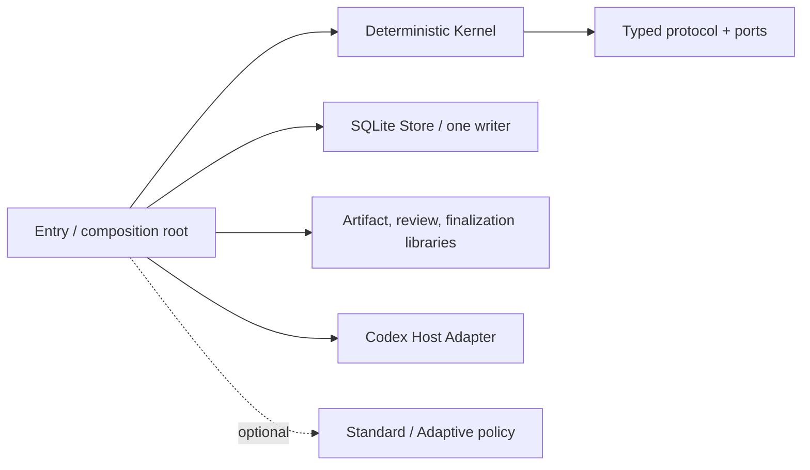

# LoopSkill 4.0

[](https://github.com/amanayayatu-tech/loop-skill/actions/workflows/v4-release.yml)
[](https://github.com/amanayayatu-tech/loop-skill/releases)
[](LICENSE)

[English](README.en.md) · [中文快速开始](docs/v4/quickstart.zh-CN.md) · [English quickstart](docs/v4/quickstart.en.md)

<!-- parity: identity -->
> 发布状态：此源码树是 LoopSkill 4.0.0 稳定发行；公开可用性以 `v4.0.0` tag 与 GitHub Release readback 为准。

LoopSkill 把长任务变成一个有明确授权、证据和停止条件的可恢复 loop。普通用户只提供目标或目标文件；机器负责协议身份、版本、收据和 Host readback。产品仍保留必要的人类流程：

`INTAKE / 质检 → PREPARE / 准备 → CONFIRM / 确认边界 → START / 启动`

<!-- parity: break -->
## 破坏性版本说明

LoopSkill 4 是 **v4-only hard break**。它保留 v3 已验证的安全原则，但不打开、导入、修复或运行 v3 loop、Controller Pack、MCP 状态或 CLI 数据。没有自动迁移，也没有双写。

需要继续使用旧数据时，请独立安装或保留 [LoopSkill v3.3.8](https://github.com/amanayayatu-tech/loop-skill/releases/tag/v3.3.8)。v4 安装器不会修改它。

<!-- parity: changes -->
## 4.0 的变化

- 一个 typed protocol manifest 定义 command、event、reference、receipt、capability 和 error 的 wire shape。
- deterministic Kernel 只依赖 typed protocol 与 ports；SQLite Store 是唯一 canonical writer。
- artifact、review、finalization 与 Codex Host Adapter 都在 Kernel 边界之外。
- operation ID、handle、Actor/Grant、revision、receipt、digest 和 Host identity 全由机器生成、解析或验证。
- Standard、Adaptive、Reviewer、Local Verifier、Decision Card 与 repair 是可选 policy；最小路径不加载 policy pack。
- 外部 effect 只允许一次自动 attempt；不能权威 readback 时诚实返回 `UNKNOWN` 或 `UNVERIFIABLE`。

<!-- parity: install -->
## 30 秒安装

要求：macOS 或 Linux、Git、Python 3.11–3.14。LoopSkill 4 runtime 只使用 Python 标准库。4.0.0 只有在 Linux/macOS × Python 3.11、3.12、3.13、3.14 的八个 release-CI runtime/distribution lane 全部通过后才能发布。

```bash
git clone --branch v4.0.0 --depth 1 https://github.com/amanayayatu-tech/loop-skill.git
cd loop-skill
bash scripts/install.sh
LOOPSKILL4="${CODEX_HOME:-$HOME/.codex}/skills/loopskill4/scripts/loopskill4"
"$LOOPSKILL4" --help
```

安装目标是独立的 `$CODEX_HOME/skills/loopskill4`。LoopSkill 4 自身不注册 MCP、不编辑 `config.toml`，也不要求为安装或使用 LoopSkill 4 重启 Codex App。Codex 或其他产品因无关原因仍可能要求重启。

安装器和卸载器不会编辑 Codex 配置。首次在全新 workspace 真实调用官方 Codex Host 时，Host 自身可能在配置末尾追加该 workspace 的一条 `trust_level = "trusted"` 记录。这是 Host-owned effect：发行门只允许当前机器生成的精确 canonical workspace 的单条 EOF 追加，保留真实非零 changed-byte 计数；其他配置变化或任何 auth 变化都会 fail closed。

<!-- parity: usage -->
## 最简单的使用方式

创建 `goal.json`：

```json
{
  "goal": "在 disposable 示例目录中完成并验证一个小改动",
  "task_horizon": "long",
  "write_scope": ["disposable-example"],
  "budget": "up to 4 minutes; no network or publish",
  "external_actions": [],
  "acceptance_criteria": ["focused tests pass", "result is reviewed"],
  "stop_conditions": ["stop on unknown external state"],
  "authorization_boundaries": ["no commit, push, publish, deploy, or real-user data"]
}
```

然后执行一个主入口：

```bash
LOOPSKILL4="${CODEX_HOME:-$HOME/.codex}/skills/loopskill4/scripts/loopskill4"
"$LOOPSKILL4" start goal.json
```

同一交互会先只读质检，再写本地准备产物并展示 Goal、写入范围、预算、外部动作、验收标准、停止条件和发布边界。只有精确的显式确认才能启动。非交互环境会停在 PREPARE；`DIRECT_TASK_RECOMMENDED` 不创建 loop。

确认后，公开入口启动一次官方前台 `codex exec --json --output-schema` 进程。官方可执行文件负责其内部 thread/turn 生命周期；LoopSkill 只通过 stdin 提交已确认的语义边界，从 typed manifest 派生封闭的 outcome/summary schema，并直接捕获机器生成的 identity、终态 JSONL 与唯一结构化结果，不要求用户复制 Host identity。schema 位于机器私有的只读临时控制路径，调用后清理；不存在文本 marker 回退。它不注册 LoopSkill MCP，也不要求 App restart。

在全新 workspace 首次执行时，官方 Codex Host 可能自行在 `config.toml` 文件末尾登记一条仅含 `trust_level = "trusted"` 的 workspace trust record。LoopSkill 安装器和卸载器仍不编辑 Codex 配置；发行 canary 只接受精确绑定当前机器生成 canonical disposable workspace 的这一条 EOF append，诚实记录非零 changed bytes，并拒绝其他路径、值、重复项、前缀改写或 auth 变化。

前台进程最长运行 300 秒，并在成功、失败、超时或中断时回收整个进程组。300 秒是观察窗口，不是任务预算。只有完整 stream、零退出码、schema 合法的唯一最终结果和外部 artifact 验证全部成立才可闭合。证据丢失、畸形、失败、冲突、歧义或超时会成为 `UNKNOWN`；LoopSkill 不 resend，也不执行 `codex exec resume`。

因此 4.0.0 的普通入口只支持预期能在该观察窗口内完成的单个 Host task；更长的单次 Host 执行不在本版公开支持范围内。

也可以显式执行四个阶段：

```bash
"$LOOPSKILL4" intake goal.json
"$LOOPSKILL4" prepare goal.json --output ./prepared-loop
"$LOOPSKILL4" confirm ./prepared-loop
"$LOOPSKILL4" start ./prepared-loop --root ./loopskill4-data
```

<!-- parity: no-control -->
## 普通用户永远不手工提供什么

普通输入中的控制身份数量必须为 0。用户不复制 task/thread/turn/route/effect/artifact/review/finalization ID，不粘贴 SHA、receipt、Pack identity、Gateway schema、MCP/App enum、heartbeat、readback 或 retry 参数。即使模型文本含有这些值，它们也不获得 authority。

<!-- parity: status -->
## 状态、结果与限制

```bash
"$LOOPSKILL4" status --root ./loopskill4-data
"$LOOPSKILL4" status --refresh --root ./loopskill4-data
"$LOOPSKILL4" status --root ./loopskill4-data --diagnostics
```

普通 `status` 只读本地状态。若崩溃发生在本地 Attempt 提交后、执行权被取得前，`status --refresh` 可以取得该 Attempt 并完成唯一首次 invocation。一旦进程已经启动，4.0.0 没有跨进程 Host readback 或自动 resume；丢失的终态证据保持 `UNKNOWN`。它绝不第二次 spawn 或 resend。默认状态只展示目标、进度、结果、限制和可行动的下一步。内部 identity 与 receipt 只在显式 diagnostics 中出现。`UNKNOWN` 表示外部动作可能已经发生但无法权威确认；`UNVERIFIABLE` 表示 Host 不能提供所需证明。两者都不是成功。

<!-- parity: policy -->
## 可选策略

Standard 提供固定、依赖有序的 Goal Queue。Adaptive 提供一个 active goal 和有界、版本化的 roadmap revision。Reviewer、Local Verifier、Decision Card、human steering 与 bounded repair 都是可选能力，只能提交受权 semantic command，不能写 Store、签 Host receipt 或成为 Supervisor。

<!-- parity: architecture -->
## 架构


```mermaid
flowchart LR
    E["Entry / composition root"] --> K["Deterministic Kernel"]
    K --> P["Typed protocol + ports"]
    E --> S["SQLite Store / one writer"]
    E --> A["Artifact, review, finalization libraries"]
    E --> H["Codex Host Adapter"]
    E -. optional .-> O["Standard / Adaptive policy"]
```

Store 不控制 Host；Artifact 与 Host 不写 canonical state。一个 state authority 可以维护正交 aggregate/event streams，不等于一个巨大 enum 或单一物理 event stream。详见 [架构图](docs/v4/architecture-map.md)、[ADR 0011](docs/adr/0011-loopskill-4-compatible-kernel-refactor.md) 与 [typed protocol](protocol/v4/README.md)。

<!-- parity: safety -->
## 安全与恢复

- 本地 operation acceptance、per-loop CAS、outbox 与 snapshot 在一个 SQLite transaction 中提交。
- 相同 operation ID 和相同请求重放不产生第二个 event、handle 或 effect；不同请求返回 idempotency conflict。
- provider 有 idempotency key 且存在 authoritative readback 时只称 effectively-once。
- 否则仅承诺 at-most-one automatic attempt；crash/lost response 可能留下 `UNKNOWN`。
- path traversal、symlink、casefold alias、special file 和 open/read race 都 fail closed。
- artifact correctness、workflow closure、assurance 和 external-effect finalization 是不同事实，不能互相替代。

<!-- parity: evidence -->
## 证据边界

仓库的 unit、fault-injection、conformance、isolated install 与 disposable 前台 Codex exec canary 只证明绑定版本和场景中的合同行为。它们不证明 patch-success 优势、任意长期任务有效性、Host 无故障或跨系统 exactly-once。

<!-- parity: v3 -->
## v3 硬边界

v4 遇到 v3 root、state 或 Controller Pack 时零写入，并返回稳定的 `USER_UNSUPPORTED_LEGACY_VERSION`，指向 [v3.3.8 Release](https://github.com/amanayayatu-tech/loop-skill/releases/tag/v3.3.8)。v4 不提供 importer、repair、legacy CLI alias、Pack runtime 或 v3 MCP State Gateway。

<!-- parity: uninstall -->
## 卸载与回退

安装器会机器绑定唯一 active receipt；普通用户无需复制或填写 receipt：

```bash
python3 "${CODEX_HOME:-$HOME/.codex}/install-receipts/loopskill4/uninstall_v4.py" --codex-home "${CODEX_HOME:-$HOME/.codex}"
```

这个 digest 绑定的管理入口位于安装目标之外，因此同一命令可安全重跑并返回 `ALREADY_UNINSTALLED`。卸载器自动解析并验证机器绑定的 receipt；缺失、漂移或歧义都会 fail closed。它只移除 receipt 绑定的 v4 安装，保持 `config.toml` 和独立 v3 安装字节不变。回退意味着卸载 v4 后继续使用单独的 v3.3.8；v4 不恢复、转换或迁移 v3 数据。

<!-- parity: limitations -->
## 已知限制

- 首发只支持 Codex Host Adapter；Kernel host-neutral 不等于 multi-host 支持。
- 已验证的 Codex Desktop folder-open → `list_projects` → `projectId` →
  `create_thread` 路线有 23/23 provisioning receipts，但 4.0.0 不接入该
  路线。默认路径是 cwd-bound 前台 `codex exec` invocation；不承诺
  Desktop-visible saved project/task。
- 4.0.0 没有 provider idempotency、跨进程 lifecycle readback 或自动
  `codex exec resume`。
- 不承诺 SQLite/Codex/Git/network 的跨系统 exactly-once。
- 不承诺实证 patch-success 提升或长期任务优越性。
- memory isolation 只报告 Host 实际可证明的能力，可能是 unavailable 或 unverifiable。
- Git/non-Git/new-Git capture 只在授权 root 和已验证 capability 内运行。

完整列表见 [已知限制](docs/v4/known-limitations.md)。

<!-- parity: contributor -->
## 开发与验证

```bash
python3 -m venv .venv
.venv/bin/python -m pip install --disable-pip-version-check -r requirements-test.txt
.venv/bin/python scripts/generate_v4_protocol.py --check
.venv/bin/python scripts/validate_v4_preservation.py --root . --json
PYTHONDONTWRITEBYTECODE=1 .venv/bin/python -B -W error -m unittest discover -s tests -p 'test_v4*.py' -v
.venv/bin/python -m coverage run -m unittest discover -s tests -p 'test_v4*.py'
.venv/bin/python -m coverage report --fail-under=80
.venv/bin/python scripts/check_v4_docs.py --smoke
```

CI 还执行 Linux/macOS × Python 3.11–3.14 的八个 runtime/distribution lane、隔离安装、dependency/import graph、stale legacy runtime、privacy/secret/large artifact、SBOM/license 和 release identity 门禁。单一本地 Python 结果不能替代该矩阵。真实前台 Codex exec canary 只在本地 exact-SHA release gate 运行；GitHub-hosted runner 不调用模型。

<!-- parity: release -->
## 发布、安全与历史版本

- [v4 发布流程](docs/RELEASING.md)
- [4.0.0 release notes](docs/v4/release-notes.md)
- [Security policy](SECURITY.md)
- [MIT License](LICENSE)
- [v3.3.8 historical release](https://github.com/amanayayatu-tech/loop-skill/releases/tag/v3.3.8)
- [All GitHub Releases](https://github.com/amanayayatu-tech/loop-skill/releases)
