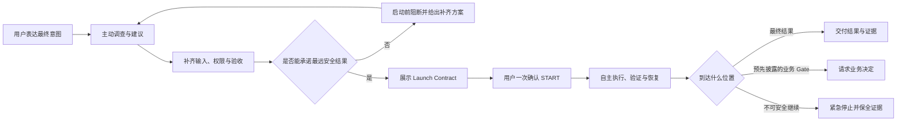

# LoopSkill 5.0 产品与交付总计划

- 状态：`DEVELOPMENT / PRODUCT DIRECTION APPROVED`
- 文档版本：`0.2`
- 产品版本：`LoopSkill 5.0`
- 日期：`2026-08-02`
- 产品负责人：Owner
- 授权边界：正式 canary、平台写入和发布必须由 Owner 针对 exact candidate 在对应 Gate 单独授权；本文件本身不授予任何执行权限
- 单一事实来源：本文件是 5.0 当前唯一产品总计划；后续技术设计必须引用本文件，不得另起一套产品定义

> 本文中的阶段、职责和结果名称首先描述产品行为，不自动要求新增同名模块、命令、schema、状态或服务。

## 0. 一页结论

LoopSkill 5.0 不是 v4.3 的续修版，而是一次产品目标重新归位：

> **自主推进是产品价值；START 是交付承诺；诚实停止是罕见的安全底线。**

用户不需要先理解 LoopSkill，也不需要预先知道长程任务会缺哪些材料、权限、环境能力或验收条件。用户先表达最终意图，LoopSkill 应在 START 前主动调查、给出建议、暴露缺口、协助补齐条件，并把任务准备成尽可能完整、尽可能长程、尽可能接近最终结果的一次 Loop。

用户确认 START 后，LoopSkill 在约定权限和风险范围内自行规划、执行、验证、恢复和继续，直到：

1. 完成用户真正想要的最终结果；或
2. 到达启动前明确披露、且无法通过预先准备消除的最远业务 Gate。

运行中因 PATH、权限、Store、端口、验证器配置、已知 Host 能力、运行时目录、预算时间不匹配等问题要求用户救场，即使记录诚实，也属于 **错误准入和产品失败**。

### 面向用户的发布说明草案

LoopSkill 5.0 帮你把一句目标或一份 PRD，准备成一项可以放心离开的长程任务。它会先阅读项目、检查环境、找出缺失条件、告诉你怎样准备得更完整，并给出一份清楚的运行承诺：会完成什么、预计多久、允许做什么、哪些故障会自行恢复、什么情况才会找你。你确认一次后，它会自主推进到最终结果或真正需要你做业务决定的位置，而不是因为内部技术问题不断暂停。

## 1. 为什么必须是 5.0

### 1.1 已观察到的问题

此前版本已经证明了若干重要安全能力：不伪造成功、不盲目重发不确定外部动作、保存终止证据、区分 artifact 与完成主张、在权限或完整性异常时 fail closed。这些能力应保留。

但真实使用同时暴露出更根本的产品失配：

- PREPARE 通过后，START 才发现 PATH、权限、Store、端口、executable 或 Host 能力不可用。
- Controller、Verifier、Plan 或 Capability 故障被转化成 Worker 失败、repair 消耗或 successor。
- 测试和静态 artifact 通过，但真实用户关键旅程并未闭合。
- 用户只是改变合法业务范围，也可能被迫创建新 Loop、重复确认或重复执行。
- 所谓观察窗口实际会终止长任务，产品承诺与运行语义不一致。
- 系统内部变得更严谨，但用户需要不断回来判断技术问题。
- 为修复每次事故持续增加字段、状态、命令和恢复协议，复杂度再次膨胀。

### 1.2 根因判断

问题不只是若干实现 Bug，而是优化目标发生了偏移：

- 把“状态可审计”放在了“任务能自主推进”之前。
- 把“安全停止”当成了合格结果，而不是最后兜底。
- 把“计划结构有效”误当成“计划在真实环境中可执行”。
- 把“承诺到达某个 Gate”当成成功，却没有要求这个 Gate 是最远可安全到达的位置。
- 用减少代码结构复杂度换取更多用户协调复杂度。

### 1.3 5.0 的产品假设

如果 LoopSkill 能够在 START 前主动帮助用户闭合目标、输入、权限、环境、能力、关键旅程、预算和验收，并只准入能够到达明确结果的任务；同时在 START 后内部处理可恢复技术故障，那么用户会真正获得长程自主执行价值，而安全与证据语义无需退让。

## 2. 产品宪法

以下条款是 5.0 不可通过“架构简化”删除的产品不变量。

### C1. 最终意图优先

LoopSkill 必须理解用户最终想得到什么，不得只机械执行表面步骤、单个 Goal 或一份形式正确的 Plan。

### C2. 启动前主动准备

用户负责表达意图和作价值判断；LoopSkill 负责调查现状、发现缺口、给出建议、推荐默认方案，并把意图编译成可执行任务。普通用户不负责填写 JSON、控制 ID、digest、状态或恢复参数。

### C3. 最大化自主跨度

LoopSkill 必须尝试到达最终结果。若存在业务 Gate，必须证明它是当前权限和条件下的最远安全 Gate。不得通过人为缩短承诺范围来提高成功率。

### C4. START 是承诺，不是尝试许可

允许 START 表示 LoopSkill 已完成准入判断，并承诺在披露的环境、权限、预算和风险包络内，自主到达承诺结果。无法建立该承诺时必须拒绝 START。

### C5. 技术性人工介入为零

START 之后，用户不应被要求修改权限、换 Store、修 PATH、释放端口、重启验证器、重新提交同一任务、解释内部状态或创建 successor。此类介入一律记为产品缺陷。

### C6. 可恢复问题内部恢复

短暂故障、进程异常、验证器问题、可重建临时环境、等待资源和其他已声明可恢复事件，应在原 Loop 和原业务目标内继续，不向用户转嫁控制面操作。

### C7. 诚实停止是紧急刹车

只有继续可能越权、产生重复或不确定外部效果、破坏证据，或遇到启动前无法合理发现且无法安全恢复的环境变化时，才允许紧急停止。停止必须诚实，但不能被统计为产品成功。

### C8. 业务真相高于流程真相

状态机运行正确、文件存在、测试通过或证据完整，都不能自动证明用户目标完成。最终报告必须以真实业务旅程和验收条件为准。

### C9. 复杂度由系统吸收

内部重构只有在不增加用户协调成本时才算简化。删除代码却增加提问、确认、救场和续跑次数，属于伪简化。

### C10. 证据不可伪造

自主推进不得以盲重试、不安全越权、改写历史、复活终止身份或把 UNKNOWN 写成 PASS 为代价。外部效果不确定时仍必须 fail closed。

### 2.1 自主性不可越过的安全底线

以下历史优势必须作为行为保留，但不要求继承旧实现：

- 不确定外部效果不得盲目重发。
- Artifact、业务完成、人工批准和公开发布必须分别举证。
- 无法验证的结果不得写成 PASS，低层测试不得冒充高层业务完成。
- 过期确认、错误上下文或旧 artifact 不得继续授权新动作。
- 终止和限制证据不得被改写、复活或通过换身份洗白。
- 秘密不得进入 Plan、Prompt、日志、artifact 或公开报告；发现已暴露秘密时要求轮换。
- 未授权写入、网络、付费、发布、删除和部署不得因“自主推进”而默认扩大。
- 状态、证据与实际业务结果冲突时，必须显示冲突并停止更高完成主张。

## 3. 关键定义

| 术语 | 5.0 定义 |
| --- | --- |
| 最终意图 | 用户真正希望获得的业务结果，而不是系统拆出的中间动作。 |
| 承诺结果 | START 时 LoopSkill 明确承诺自主交付的可验收结果。优先等于最终意图。 |
| 最远安全 Gate | 已穷尽合理预准备后，剩余动作确实需要新的用户价值判断或不可预授权权限的位置。 |
| Launch Contract | START 前呈现给用户的一页运行承诺，包含结果、范围、条件、恢复和停止边界。 |
| 技术性人工介入 | 要求用户处理系统本可预检或安全恢复的技术问题。 |
| 业务介入 | 需要用户改变目标、作价值判断、授权不可逆动作、提供秘密或作最终批准。 |
| 错误准入 | Loop 获准 START 后，因可预见技术问题或已知能力缺口提前停止。 |
| 可避免早停 | 通过启动前补充信息、授权、建议或能力检查，本可消除的提前 Gate 或停止。 |
| 可恢复事件 | 在已授权范围内可以安全重试、重建、等待、切换等价路径或继续的技术事件。 |
| 紧急停止 | 遇到无法安全继续的未预见事件时保全证据和副作用边界的最后动作。 |
| 自主跨度 | 从 START 到最终结果或第一次不可消除业务 Gate 之间，无需用户介入的时间和工作范围。 |

## 4. 目标用户与适用任务

### 4.1 主要用户

主要用户是使用 Codex 完成本地、单用户、证据敏感型工作的 Owner。他能够说明最终结果并作业务决定，但不应被要求理解 LoopSkill 的内部协议和恢复机制。

### 4.2 适合进入 5.0 Loop

- 跨多个步骤、多个上下文或较长时间才能完成的任务。
- 需要阅读现有项目并根据证据调整实现路线的任务。
- 需要文件、代码、测试、真实业务流程或外部效果共同验收的任务。
- 用户希望一次交代后离开，回来查看最终结果或真正业务 Gate 的任务。
- 需要明确写入范围、成本、秘密、发布、付费或不可逆动作边界的任务。

### 4.3 应直接执行而不进入 Loop

- 一次问答、简单翻译、单个明确命令或很小的低风险修改。
- 用户准备全程在场、可以立即验收的短任务。
- 无法定义最终结果，也不愿意补充任何验收边界的任务。
- 任务依赖当前不可用能力，且不存在安全替代路径。

## 5. 完整用户旅程



### 5.1 表达意图

用户可以提供一句话、PRD、附件、仓库或已有上下文。系统不得把“输入格式不专业”变成用户负担。

### 5.2 主动调查

LoopSkill 在授权的只读范围内检查项目、资料、环境和历史状态，区分：

- 已确认事实；
- 可以安全验证的事实；
- 需要用户决定的事项；
- 尚不可获得的能力；
- 不应被自动推断的权限或业务判断。

### 5.3 提供建议

LoopSkill 不只列出缺口，还应说明：

- 推荐采用什么完成路线；
- 哪些范围可以合并到同一次 Loop；
- 提供哪些材料或授权能延长无人值守跨度；
- 哪些要求会造成中途 Gate；
- 哪些动作可以预授权，哪些应保留最终确认；
- 预计时间、成本和风险如何变化。

建议必须与用户决定分开，不能用系统建议替代授权。

### 5.4 一次性补齐

系统先自行读取和验证，再集中提出真正阻断启动的决策问题。问题应附推荐选项和影响，目标是让用户一次回答后即可形成最终 Launch Contract。

不得为了遵守机械的问题数量上限而隐藏已知阻断。复杂任务允许第二轮，但只有用户答案引入新的实质分支时才合理。

### 5.5 确认并离开

用户看到的是一页人类可读承诺，不是内部协议。确认后，用户可以合理预期在声明的无人值守窗口内无需处理技术问题。

### 5.6 回来查看结果

结果页面首先回答：

1. 最终业务目标完成了吗？
2. 当前准确停在哪个业务层？
3. 做成了什么，未做成什么？
4. 有哪些外部效果和限制？
5. 若需要用户行动，具体是哪一个业务决定？

## 6. START 前的主动任务设计

### 6.1 用户与 LoopSkill 的责任边界

| 用户负责 | LoopSkill 负责 |
| --- | --- |
| 表达最终意图 | 理解并复述可验收的最终结果 |
| 作价值判断 | 调查项目、环境和能力 |
| 授权范围与高风险动作 | 发现全部当前可见的阻断和矛盾 |
| 提供系统无法取得的秘密或业务资料 | 给出推荐路线、默认建议和权衡 |
| 确认 Launch Contract | 编译执行计划并验证其真实可运行性 |
| 在真正业务 Gate 作决定 | 最大化一次 START 的自主跨度 |

### 6.2 启动前必须闭合的七层问题

1. **结果层**：最终结果、允许的替代结果、完成边界是否明确。
2. **旅程层**：真实用户关键旅程是否存在可执行验收，而不只是文件或测试数量。
3. **输入层**：源码、数据、附件、账户、秘密和外部依赖是否可获得。
4. **权限层**：写入、网络、付费、提交、发布、删除和不可逆动作是否明确授权。
5. **环境层**：工作区、脏改动、运行时、executable、PATH、端口、Store、scratch 和权限是否真实可用。
6. **持续运行层**：Host 能力、最长执行窗口、等待/唤醒、上下文续接和恢复路径是否足以覆盖任务。
7. **验收层**：每项完成主张由什么业务证据、机器证据或人工批准支持。

### 6.3 最大化自主跨度的规则

LoopSkill 形成初步路线后，必须执行一次“能否走得更远”的反向检查：

- 当前 Gate 是否可以通过现在补充一个答案、文件、凭据或授权消除？
- 是否可以在安全上限内预授权某类动作，而不是运行中逐项确认？
- 是否可以先在 scratch、临时副本或 dry run 中完成更多验证？
- 是否把系统内部里程碑错误暴露成了用户 Gate？
- 是否因为实现方便而缩短了承诺结果？

只要答案为“是”，系统就应先向用户给出建议，而不是接受较短的 Loop。

## 7. Launch Contract

### 7.1 人类可读合同的最小内容

| 字段 | 必须回答的问题 |
| --- | --- |
| 最终意图 | 用户最终想得到什么？ |
| 本次承诺结果 | 本次 START 将自主交付到哪里？ |
| 未覆盖部分 | 为什么不能纳入本次承诺，怎样才能纳入？ |
| 关键旅程 | 哪条真实路径证明结果可用？ |
| 验收证据 | 用什么证据判断完成、限制或失败？ |
| 授权范围 | 允许写什么、调用什么、花费多少、做哪些外部动作？ |
| 已验证条件 | 哪些输入、权限、环境和 Host 能力已真实检查？ |
| 自动恢复范围 | 哪些故障会自行处理，恢复上限是什么？ |
| 业务 Gate | 哪些事件确实需要用户作决定？ |
| 紧急停止条件 | 哪些极端情况会提前终止？ |
| 无人值守预期 | 预计时长、最长等待和用户何时需要回来？ |
| 外部效果 | 可能产生哪些提交、消息、发布、付费或其他不可逆效果？ |

### 7.2 用户看到的示例

> **你希望得到**：Nepha 本地核心工作流可真实使用，并准备好等待 Owner 最终审批。
>
> **本次承诺**：在 2–4 小时内，自主完成实现、测试、真实输入到导出的关键旅程验证，并停在最终 Owner 审批；不会因 PATH、端口、Store 或验证器问题找你。
>
> **已验证**：项目路径、脏改动边界、Node/npm、数据 scratch、loopback 服务、测试命令和写入权限。
>
> **建议**：如果现在提供 5 个真实样本，可把承诺从“候选可用”提高到“真实样本验证完成”；否则这会成为预先披露的业务 Gate。
>
> **自动处理**：临时端口冲突、验证器重启、短暂进程失败和安全范围内的实现修复。
>
> **会找你**：改变产品范围、增加付费或外部发布、启动后才出现且无法预授权的新账户授权、最终 Owner 批准。
>
> **紧急停止**：外部动作是否发生无法确认、环境身份异常变化或证据损坏。

### 7.3 准入规则

只有同时满足以下条件才能 START：

- 承诺结果和验收证据明确。
- 所有当前可见的技术阻断已消除或有已验证的自动恢复路径。
- 承诺结果是当前条件下的最远安全结果。
- 用户理解未覆盖部分、业务 Gate 和紧急停止边界。
- 外部动作、秘密、付费和不可逆风险处于明确授权内。
- 声明的无人值守时长不超过已验证 Host 能力。

不能满足时，系统应在启动前给出补齐方案。拒绝 START 不算运行失败；错误地允许 START 才算。

## 8. START 后的自主运行

### 8.1 对用户只暴露四种有意义的运行结果

| 结果 | 用户含义 | 是否应找用户 |
| --- | --- | --- |
| 正常推进 | 正在按承诺工作 | 否 |
| 内部恢复 | 遇到技术问题但正在安全恢复 | 否 |
| 业务 Gate | 已到达预先说明的业务决策点 | 是 |
| 紧急停止 | 继续存在越权、重复效果或证据风险 | 是，但这是产品异常而非成功 |

这些结果不要求成为四个新的协议状态；实现可采用更少的内部机制。

### 8.2 内部里程碑不是人工 Gate

LoopSkill 可以把长任务拆成多个内部里程碑、Worker 工作段或验证步骤，但它们默认由系统自行推进。以下情况不得要求用户再次 START：

- 前一内部 Goal 已完成；
- 需要开始下一内部 Goal；
- Controller 或 Verifier 重启；
- 安全修复后继续同一业务目标；
- 临时资源等待结束；
- 需要在已授权范围内调整实现路线。

### 8.3 可恢复事件的处理原则

1. 先判断外部效果是否已知，禁止盲目重复不可逆动作。
2. 在现有权限和预算内选择最窄恢复动作。
3. 保留失败和恢复证据，但不要求用户操作控制面。
4. 恢复后继续原业务目标，不把内部故障变成新的 Loop 身份。
5. 同一根因反复出现时升级策略或缩小主张，禁止无限空转。
6. 若恢复需要扩大权限、成本或业务范围，才转为业务 Gate。

### 8.4 持续运行的产品要求

- 长任务不能依赖一个短观察窗口冒充持续执行能力。
- 用户离开对话后，系统应按 Launch Contract 继续；界面是否持续展示不是完成证据。
- 普通上下文切换、内部工作段结束或可恢复进程退出，不应终止 Loop。
- 跨等待窗口任务应采用 Host-native 定时退出、同一 Codex task 重新进入和安全续接，而不是让一个进程永久占用。
- 如果当前 Host 无法保证声明时长或续接能力，必须在 START 前降低承诺或拒绝启动。

5.0 首次公开版本的等待主张只覆盖同一 Codex task 的定时退出、至少两次 Host-native same-thread reentry 和安全续接。多日耐久移到发布后验证；操作系统睡眠或关机恢复不作为首发承诺。

## 9. 人类 Gate 与停止边界

### 9.1 合法的人类 Gate

- 改变最终目标或实质范围。
- 新增未预授权的付费、发布、部署、删除或不可逆外部动作。
- 提供启动前已披露、但客观上只能在运行到该阶段时取得的秘密、账户或法律/业务材料；启动前已经缺失的已知必需项必须先补齐，不得留作运行中 Gate。
- 在多个业务可行方案中作价值判断。
- 对最终内容、研究结论、产品候选或公开发布作 Owner 批准。
- 接受明确降低后的结果主张。

### 9.2 不合法的人类 Gate

- 修 PATH、chmod、Store root、端口或 scratch。
- 告诉系统应该重跑 Verifier 还是 Worker。
- 手动重新启动同一 Goal 或创建 successor。
- 解释内部状态为何 PAUSED/ACTIVE 不一致。
- 补充启动前即可发现的 executable、依赖或 Host 能力。
- 因系统问题扩大 attempt、repair 或观察预算。
- 为内部 milestone 逐次确认。

### 9.3 紧急停止允许的类别

- 不可逆外部动作可能已经发生，但无法确认结果，重试可能重复产生效果。
- 运行环境、工作区或身份发生未授权且无法安全解释的变化。
- 权威证据、状态或 artifact 损坏，继续会制造虚假主张。
- 遇到启动前无法合理发现的新安全风险。
- 已授权资源上限耗尽，且继续需要新的用户授权。

紧急停止报告必须说明：实际停止层、已完成业务结果、未完成结果、已知外部效果、未知项、是否可恢复，以及为何该风险未在启动前发现。

## 10. 成功指标与防作弊指标

### 10.1 北极星指标

**承诺结果自主到达率**：

```text
获准 START 且在零技术性人工介入下到达承诺结果的 Loop 数
÷
全部获准 START 的 Loop 数
```

### 10.2 防止把 Gate 定得过近

北极星必须同时满足 **最远 Gate 合理性**：每次准入评审都要回答，是否存在通过启动前补齐信息、授权或系统自身技术恢复就能继续推进的可避免早停。发布验收要求为 `0`。

### 10.3 5.0 发布硬指标

| 指标 | 发布目标 |
| --- | ---: |
| 黄金旅程中的技术性人工介入 | `0` |
| 历史事故语料中的错误准入 | `0` |
| 可避免早停 | `0` |
| 重复或无法解释的外部效果 | `0` |
| 业务结果与状态/报告一致率 | `100%` |
| 普通用户手填内部 JSON、ID、digest 或恢复命令 | `0` |
| 已披露可恢复事件导致新 Loop/successor | `0` |
| START 后因已知 PATH/权限/Store/端口/验证器能力停止 | `0` |

测试数量、代码覆盖率、schema 数量、状态完整度和内部 receipt 数量不是产品成功指标，只能作为支持性工程证据。

## 11. 5.0 首发范围

### 11.1 必须具备

- 自然语言或 PRD 驱动的主动任务准备。
- 系统调查后给出具体建议和一次性补齐清单。
- 人类可读、可重新验证的 Launch Contract。
- 一次 START 后跨多个内部工作段持续推进。
- 对首发事故语料中的技术故障进行预检或内部恢复。
- 以真实业务关键旅程而非静态 artifact 作验收。
- 最终结果、业务 Gate、限制和紧急停止的诚实报告。
- 本地单用户场景下的权限、秘密和外部效果边界。

### 11.2 首发非目标

- 通用 DAG、任意工作流 DSL 或可视化流程编排器。
- multi-host、分布式调度、团队多租户或并行多写者。
- 通用 daemon、通用队列服务或为未来需求设计的插件系统。
- Byzantine 安全、跨所有外部系统的 exactly-once 保证。
- 自动绕过系统权限、秘密、付费或人工审批。
- 支持所有项目类型、任意长运行时间或任意第三方 Provider。
- 在 5.0 首发中迁移、复活或改写 v3/v4 已有 Loop。
- 为兼容 v4.3 草稿保留其 Plan v3、状态、命令或 schema。
- 用更多治理文档、角色或 receipt 替代真实用户旅程验证。

### 11.3 版本与历史边界

- v4.3 当前工作树保留为只读事故样本，不作为 5.0 实现基础或候选。
- 不整体 cherry-pick v4.3；任何代码复用都必须证明直接服务于当前 5.0 黄金路径，并通过新的验收。
- v3/v4 的终止证据和用户数据保持原样。
- 5.0 开发期采用独立入口、安装身份和数据位置，优先并存而不是迁移。
- 旧版本迁移只有在 5.0 本身稳定后，经过新的明确决策才能进入范围。

## 12. 核心产品需求

### P0-1 主动任务塑形

作为用户，我只需说明最终意图，LoopSkill 就能读取已有材料、识别缺口、给出建议，并将其整理成可验收任务。

验收：

- 不要求普通用户先写 schema 或内部 JSON。
- 对同一事实不重复提问。
- 每个问题都是当前无法自行验证且会改变结果、权限或风险的真实决策。
- 已知阻断必须一次性完整披露，不为缩短回答而隐藏。

### P0-2 自主跨度优化

作为用户，我希望 LoopSkill 告诉我还需要提供什么，才能让任务一次跑得更远。

验收：

- Launch Contract 明确最终意图、承诺结果和未覆盖部分。
- 对每个提前 Gate 给出消除它所需的具体条件。
- 若系统本可自行解决，不能把该项列为用户 Gate。

### P0-3 真实准入

作为用户，我希望 START 表示任务具备真实可执行条件，而不是结构上看似合法。

验收：

- 已知环境、权限、Host、验证器、持续时间和关键旅程问题在 START 前被验证。
- START 前后关键条件漂移会拒绝副作用并要求重新准备。
- 不能验证的能力在合同中明确降低承诺或阻断启动。

### P0-4 一次 START 自主推进

作为用户，我确认一次后可以离开，直到最终结果或真正业务 Gate。

验收：

- 内部 Goal、里程碑、验证和恢复无需用户逐项确认。
- 技术性人工介入为零。
- 普通上下文和工作段切换不产生新 Loop 身份。

### P0-5 安全自动恢复

作为用户，我希望安全可恢复的技术故障不打断我，也不重复外部效果。

验收：

- 每类可恢复事件有明确的恢复证据和上限。
- Controller/Verifier/Capability 故障不消耗业务 Worker 修复预算。
- 恢复发生在同一业务目标中，历史失败保留但不阻塞正常继续。
- 外部效果不确定时禁止盲重试。

### P0-6 业务 Gate

作为用户，我只在必须作价值判断或授权时收到请求。

验收：

- 请求说明已完成结果、待决定事项、推荐选项和每个选项影响。
- Gate 与 Launch Contract 一致；非预期 Gate 记为异常。
- 用户决定后，在原 Loop 继续，除非目标身份发生根本变化。

### P0-7 真实完成报告

作为用户，我回来时能立即知道业务是否完成，而不是只看到流程状态。

验收：

- 第一结论是最终意图的完成度。
- 严格区分已观察事实、推断、未知和限制。
- 列出实际外部效果及其证据。
- 诚实停止不能被展示成成功。

## 13. 技术方向约束，而非预设架构

5.0 先验证产品纵切，再选择实现。当前只锁定以下约束：

1. 优先使用 Host 已有的任务、工具和续接能力；只有可复现缺口才增加自有控制面。
2. 保持一个权威任务契约和一个权威进度/效果事实来源，避免多套状态互相覆盖。
3. 计划、执行、验证和恢复职责可以在同一最小实现中完成，不因概念不同就拆成服务。
4. 新增模块、状态、命令、schema、wrapper、validator、gate 或恢复机制前，必须指出它解决的当前黄金路径失败。
5. 能通过对话层建议、现有工具调用或局部函数解决的问题，不升级为通用协议。
6. 实现不得要求用户手动协调内部角色、任务、receipt 或 Store。
7. 首个 walking skeleton 未跑通前，不建设兼容层、扩展系统或完整治理框架。

### 13.1 架构选择门

架构方案只有在一个最小真实纵切中证明以下能力后才能被接受：

- 自然语言输入能够形成 Launch Contract。
- START 前能识别该纵切的全部已知阻断。
- 一次 START 能跨至少两个内部工作段到达真实业务结果。
- 注入一个可恢复技术故障后无需用户介入。
- 最终报告与工作区和业务旅程一致。

未通过纵切的“优雅架构”不得继续扩展。

## 14. 历史事故如何进入 5.0

| 历史事故 | 5.0 应有行为 | 验收类型 |
| --- | --- | --- |
| Store 目录因 umask 成为 0755 | START 前验证或系统安全创建；不得要求 chmod | 准入回归 |
| `env: []` 导致找不到 npm | 构造已验证的安全执行环境；不得消耗 Worker | 准入回归 |
| executable 在 START 后才缺失 | START 前解析并验证，漂移时零副作用拒绝 | 准入回归 |
| 已有文件被 transition verifier 判不存在 | 计划语义与实际验收对象一致 | 语义回归 |
| 端口占用或 listener EPERM | 预检；竞态发生时自动换端口或安全恢复 | 恢复回归 |
| nested Codex 无权写状态 | Host 能力在承诺前真实验证，不能靠 capability flag | 能力回归 |
| Controller/Verifier 故障耗尽 Worker attempt | 故障归责隔离，业务预算不受影响 | 恢复回归 |
| PAUSED 被显示成 Active | 业务和控制状态来自同一权威事实 | 状态回归 |
| runtime 数据污染源码 | 默认隔离到 scratch，并按声明范围验证源码 | 环境回归 |
| 一个宽 Goal 包含多个独立故障 | 系统内部重新规划或分段恢复，不让用户建 successor | 自治回归 |
| Telegram 被 Owner 跳过只能建 successor | 合法业务决定在原 Loop 继续并调整最终主张 | Gate 回归 |
| 测试全绿但 `/api/intake` 为 501 | 必须运行真实用户关键旅程 | 黄金旅程 |
| 300 秒观察窗口实际杀死任务 | 运行时长语义与 Launch Contract 一致 | 持续运行回归 |
| 真实旧版本升级失败但伪造测试通过 | 测试真实用户路径和真实历史字节 | 发布回归 |

事故记录用于定义行为和回归，不要求继承当时为事故设计的具体字段或状态。

## 15. 验证策略

### 15.1 验证优先级

1. 真实用户黄金旅程。
2. 历史事故的确定性回归。
3. 核心安全不变量和外部效果测试。
4. 直接相关的单元测试。
5. 覆盖率和静态检查作为支持证据。

禁止用第 4、5 层替代第 1 层。

### 15.2 三条首发黄金旅程

#### GJ-1：真实代码仓库交付

从自然语言需求开始，LoopSkill 调查脏工作树、提出范围和验收建议，用户一次确认后完成代码修改、相关测试、业务 smoke 和交付报告。运行中注入一次可恢复的 Verifier/进程故障。

通过条件：零技术介入、无用户手填控制信息、真实行为通过、未触碰未授权路径。

#### GJ-2：Nepha 核心业务旅程

在中文路径的干净副本中，从真实输入经过主题、Brief、确认、Draft、平台包、质量、批准、导出和持久化 readback，推进到启动前约定的最终 Owner Gate。

通过条件：一次 START；PATH、端口、Store、scratch、nested Codex 和验证器问题均不找用户；测试与关键旅程同时成立。

#### GJ-3：跨等待窗口的长程任务

任务包含主动执行、按合同定时退出、至少两次 Host-native same-thread reentry 和安全续接，最终到达业务结果或审批 Gate。

通过条件：等待不是终止；无需用户重发任务；每次重入都从同一最小效果事实安全续接且不重复外部效果；最终状态与业务完成度一致。

### 15.3 发布重复要求

- 每条黄金旅程在干净环境中连续通过两次。
- 至少一次从全新安装开始，至少一次包含可恢复故障注入。
- GJ-3 在 pre-merge exact candidate 与 merged-main 新候选上各正式运行一次；每次至少 60 分钟、至少两次真实 Host-native same-thread reentry，并证明定时退出与安全续接。多日耐久是发布后验证，不是 v5.0.0 发布 Gate。
- 所有运行绑定 exact candidate，失败证据不改写。
- DEVELOPMENT 重跑可以在修复根因后使用新运行身份；不得把旧失败改判为 PASS。
- 正式发布证据必须在用户另行授权后执行。

## 16. 分阶段路线图

以下时间是单一主要执行者的初步工作量范围，不是发布日期承诺。Phase 2 结束后必须基于真实纵切重新估算。

| 阶段 | 主要交付 | 退出 Gate | 初步工作量 |
| --- | --- | --- | ---: |
| Phase 0：产品锁定 | 产品宪法、术语、Launch Contract、事故语料、三条黄金旅程 | Owner 明确确认价值排序和非目标 | 2–4 天 |
| Phase 1：无代码任务准备验证 | 用历史和真实需求演练主动调查、建议、一次性补齐和最远 Gate | 已知阻断均在模拟 START 前暴露，用户无需 JSON | 3–5 天 |
| Phase 2：Walking Skeleton | 自然语言 → Launch Contract → 一次 START → 两个内部工作段 → 真实结果 | 一条真实代码旅程零技术介入完成，并恢复一次注入故障 | 5–8 天 |
| Phase 3：Autonomy Core | 持续执行、内部恢复、Host-native 重入、业务 Gate、真实完成报告 | 历史 P0 事故语料全通过，GJ-1/GJ-3 闭合 | 8–15 天 |
| Phase 4：真实项目 Beta | Nepha 黄金旅程、第二类项目、安装隔离和用户体验打磨 | 三条黄金旅程各连续通过两次 | 7–12 天 |
| Phase 5：5.0 Release | 文档、安装/卸载、升级边界、CI、exact-SHA canary、独立审查 | 全部发布硬指标满足且 Owner 明确授权 | 5–8 天 |

初步总量：`30–52` 个专注工作日。最大不确定性是 Host 的持续执行、原生唤醒和安全续接能力；该不确定性必须在 Phase 2 前半段通过真实 spike 消除。若 Host 能力不足，先缩小公开承诺，不用新增大型控制平面掩盖。

## 17. 防止再次过度工程化

### 17.1 新机制准入测试

每个新增机制必须同时回答：

1. 哪个当前可复现的黄金路径失败需要它？
2. 为什么现有 Host 能力或更简单局部实现不能承担？
3. 它减少了哪一次用户介入、错误准入或不安全效果？
4. 删除它会让哪条明确验收失败？

回答不完整则不进入 5.0。

### 17.2 明确禁止的复杂度来源

- 为未来多 Provider 先建抽象层。
- 为每种故障增加公开状态。
- 为每个内部步骤增加用户命令。
- 为保证文档一致再建立一套机器 registry，除非真实漂移已出现。
- 为覆盖未知未来故障建立通用恢复 DSL。
- 为兼容失败原型保留 schema 和迁移分支。
- 在黄金旅程前追求大规模 coverage、全平台矩阵或完整发布自动化。

### 17.3 停止开发条件

当当前阶段的命名行为成立、直接验证通过且下一项需要扩大架构层级时，停止并重新审查，不顺手建设相邻能力。

## 18. 主要风险与应对

| 风险 | 影响 | 应对 |
| --- | --- | --- |
| 不可能穷举所有运行故障 | START 仍可能意外停止 | 承诺能力包络，不承诺全知；持续把真实事故前移到准入或恢复 |
| 启动前沟通过长 | 用户感觉设置成本高 | 先调查、后集中提问；提供推荐默认值；短任务直接执行 |
| 为提高成功率缩短承诺 Gate | 指标好看但用户价值下降 | 最远 Gate 合理性和可避免早停作为硬指标 |
| 自动恢复重复外部效果 | 造成不可逆损失 | 先确认效果身份；不确定时紧急停止，不盲重试 |
| Host 不支持长时续接 | 无法兑现无人值守 | Phase 2 早期真实验证；不能证明就降低承诺或阻断，不伪造能力 |
| 重新堆叠状态和协议 | 5.0 再次臃肿 | 纵切优先、新机制准入测试、单一事实来源 |
| 只测 LoopSkill 自己 | 对真实项目泛化不足 | 三类真实黄金旅程，至少一条非 LoopSkill 仓库 |
| 旧版兼容拖慢核心价值 | 复杂度提前爆炸 | 首发并存、旧数据只读保留，迁移后置 |

## 19. 当前已锁定决策与待验证问题

### 19.1 已锁定

以下决定已由 Owner 于 `2026-08-02` 明确确认，并于 `2026-08-03` 更新首发等待范围：

- 版本名称为 `LoopSkill 5.0`。
- v4.3 实现路线停止，不作为 5.0 基础。
- 自主推进优先于流程结构优雅。
- 诚实停止保留，但从正常工作流降为紧急安全底线。
- START 前主动咨询、建议和补齐条件是核心产品能力。
- START 后技术性人工介入目标为零。
- 承诺结果必须是最终结果或最远安全业务 Gate。
- 首发从本地、单用户、Codex Host 场景开始。
- 首发等待主张为同一 Codex task 的定时退出、至少两次 Host-native same-thread reentry 和安全续接；多日耐久移到发布后验证，操作系统睡眠或关机恢复不作首发承诺。
- v3/v4 数据在首发中保持原样并存，不建设迁移或复活路径。
- 先跑通真实纵切，再决定架构。

### 19.2 Phase 0/2 必须用证据回答

- 当前 Host 可可靠维持多长主动执行窗口？
- 哪种原生续接或唤醒能力能在不重复外部效果的前提下继续同一 Loop？
- 最小持久事实集是什么，哪些状态可完全交给 Host？
- 外部不可逆动作能否使用简单的预授权包络，而无需新通用协议？
- v5 是否需要任何 v4 低层库，还是更小的新实现更可靠？

这些是验证题，不是现在提前建设五套抽象的理由。

## 20. 5.0 完成定义

LoopSkill 5.0 只有满足以下全部条件才可以称为可发布：

- [ ] 用户从自然语言或 PRD 开始，不需要理解内部协议。
- [ ] LoopSkill 主动提出能延长自主跨度的具体建议。
- [ ] Launch Contract 清楚说明最终意图、承诺结果和停止边界。
- [ ] 已知事故语料全部在 START 前阻断或在运行中自动恢复。
- [ ] 三条真实黄金旅程各连续通过两次。
- [ ] 每条黄金旅程技术性人工介入为零。
- [ ] 没有可避免早停或通过缩短 Gate 制造的成功。
- [ ] 外部效果无重复、无未经授权扩大、无虚假 PASS。
- [ ] 最终报告首先陈述业务结果和准确停止层。
- [ ] 代码结构经过反向删除审查，没有无当前证据支撑的机制。
- [ ] 当前 DEVELOPMENT 结果没有冒充 formal canary 或 release 证据。
- [ ] 发布前取得 Owner 对 exact candidate 和正式运行的单独授权。

## 21. 从现在开始的下一步

1. Owner 审阅并确认本文件的产品宪法、最远 Gate 原则和首发非目标。
2. 将现有事故整理成一份精简的 5.0 行为语料；只保留输入、期望行为和失败分类，不复制 4.3 实现。
3. 为 GJ-1、GJ-2、GJ-3 各写一页真实输入、关键旅程和验收事实。
4. 用这些材料进行无代码 Launch Contract 演练，确认启动前咨询是否真的能一步到位。
5. 只有 Phase 0/1 通过后，才建立独立 v5 开发入口并实现 walking skeleton。

## 附录 A：用户常见问题

### A1. 5.0 是否保证永远不停止？

不保证。它保证已知可预检问题不进入 START、已声明可恢复问题由系统内部处理，并在 START 前披露剩余紧急停止类别。不可确认的外部效果或新的安全风险仍会停止。

### A2. 为什么 START 前可能需要多花几分钟？

因为这些时间用于消除数小时后才暴露的阻断。LoopSkill 必须先自行调查，再只请用户处理真正的业务决定；它不能用长表单把准备工作推回用户。

### A3. 这是把 v3 恢复回来吗？

不是。5.0 继承 v3 的主动 Intake、长期任务塑形和用户减负价值，也继承 v4 的证据、安全和不伪造成功原则；不默认继承两者的具体 Controller、Gateway、状态机或协议。

### A4. 为什么不继续修完 v4.3？

v4.3 已经把多个事故分别固化为新状态、字段、命令和恢复路径，但没有首先证明用户能一次 START 到达真实结果。继续修补会让错误目标函数固化得更深。它应保留为事故证据，而不是未来架构。

### A5. 5.0 如何证明不是又一次纸面重构？

在架构扩展前必须跑通一个最小真实纵切；发布前必须完成三条真实黄金旅程。任何测试、schema 或文档数量都不能替代它们。

## 附录 B：Launch Contract 模板

```markdown
# 本次 Loop 运行承诺

## 1. 你的最终意图
<最终业务结果>

## 2. 本次承诺结果
<最终结果，或最远安全业务 Gate>

## 3. 为何这是最远安全结果
<已经主动消除的阻断；仍无法预授权的业务决定>

## 4. 推荐路线
<系统建议、备选方案与权衡>

## 5. 已验证条件
<输入、项目、权限、环境、Host、时长和验证能力>

## 6. 授权范围与外部效果
<写入、网络、秘密、成本、commit/push/publish/deploy/delete 等>

## 7. 验收与证据
<真实关键旅程、测试、artifact、人工审批和允许主张>

## 8. 自动恢复
<会内部处理的故障和恢复上限>

## 9. 会找你的业务 Gate
<只列真正需要价值判断或新授权的事项>

## 10. 紧急停止
<不确定外部效果、身份漂移、证据损坏等极端条件>

## 11. 无人值守预期
<预计时间、最长窗口、何时回来、若自然等待如何续接>

## 12. START
<一次明确确认；合同发生实质变化后必须重新确认>
```
